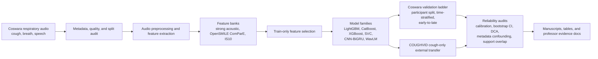

# COVID/Respiratory Audio Reliability Study

[](#claim-boundary)
[](covid_audio_btp/pyproject.toml)
[](#datasets)
[](#claim-boundary)

Reliability-aware respiratory-audio screening research using Coswara and COUGHVID. The project is not framed as a deployable COVID diagnostic model. It is an evidence-driven audit of how strong internal respiratory-audio performance changes under stricter validation, metadata-confounding checks, temporal validation, calibration, and external cough-only transfer.

## At A Glance

| Item | Current repository evidence |
|---|---|
| Core package | [`covid_audio_btp/`](covid_audio_btp/) |
| Main implementation | [`covid_audio_btp/src/covid_audio_btp/`](covid_audio_btp/src/covid_audio_btp/) |
| Scripted pipeline | [`covid_audio_btp/scripts/`](covid_audio_btp/scripts/) |
| Notebook workflow | [`covid_audio_btp/notebooks/00_RUN_EVERYTHING_PUBLICATION.ipynb`](covid_audio_btp/notebooks/00_RUN_EVERYTHING_PUBLICATION.ipynb) |
| Manuscript drafts | [`manuscripts/`](manuscripts/) |
| Frozen result folders | [`results/`](results/) |
| Archive bundles | [`artifacts/bundles/`](artifacts/bundles/) |
| Professor brief | [`covid_audio_btp/docs/professor/COVID_AUDIO_BTP_E2E_PROFESSOR_BRIEF.md`](covid_audio_btp/docs/professor/COVID_AUDIO_BTP_E2E_PROFESSOR_BRIEF.md) |
| Results evidence ledger | [`covid_audio_btp/docs/professor/COVID_AUDIO_BTP_RESULTS_EVIDENCE.md`](covid_audio_btp/docs/professor/COVID_AUDIO_BTP_RESULTS_EVIDENCE.md) |
| Source/code guardrail | [`covid_audio_btp/references/verified_source_registry.md`](covid_audio_btp/references/verified_source_registry.md) |
| Repository map | [`docs/repository/REPOSITORY_MAP.md`](docs/repository/REPOSITORY_MAP.md) |
| Artifact guide | [`ARTIFACT.md`](ARTIFACT.md) |

## Research Thesis

The safest project statement is:

> We built a multimodal COVID respiratory-audio benchmark pipeline with strong internal performance, then showed through temporal validation, metadata-confounding audits, calibration, and COUGHVID transfer that high internal respiratory-audio scores are not reliable evidence of deployable screening performance.

This means the contribution is not "we beat every COVID cough paper." The contribution is a reliability-first evaluation stack showing how internal performance degrades when validation becomes more realistic.

## Pipeline



## Headline Results

These values are copied from the repository evidence ledger in [`covid_audio_btp/docs/professor/COVID_AUDIO_BTP_RESULTS_EVIDENCE.md`](covid_audio_btp/docs/professor/COVID_AUDIO_BTP_RESULTS_EVIDENCE.md). Use the linked source files for manuscript writing.

| Evidence block | Main result | Safe interpretation |
|---|---:|---|
| Existing participant split | AUROC `0.897`, AUPRC `0.863` | Strong internal multimodal performance |
| Time-stratified participant split | AUROC `0.849`, AUPRC `0.783` | Still strong, but lower under time-aware validation |
| Early-to-late temporal validation | AUROC about `0.698` | Temporal drift damages reliability |
| COUGHVID measured audio-summary external transfer | AUROC `0.523-0.543` | Near-random external cough transfer |
| WavLM transformer external transfer | AUROC `0.484` | Transformer representation did not rescue transfer |
| CNN-BiGRU spectrogram external transfer | AUROC `0.548` | Deep spectrogram branch also weak externally |
| Full safe metadata-only shortcut | AUROC `0.964` | Metadata/context strongly predicts labels |
| Symptoms-only metadata shortcut | AUROC `0.932` | Symptom fields alone are strong predictors |
| Metadata shuffle sanity | AUROC about `0.50` | Shortcut is dataset structure, not scoring leakage |
| Early/late feature-selection stability | Jaccard `0.074` | Selected acoustic features are non-stationary |

## Datasets

| Dataset | Role | Claim boundary |
|---|---|---|
| Coswara | Primary multimodal respiratory-audio dataset | Supports internal cough, breath, and speech analysis with participant-level controls |
| COUGHVID | External cough-only stress test | Tests cough-to-cough dataset transfer only; it does not externally validate full cough+breath+speech fusion |

Raw datasets are not redistributed by this repository unless separately allowed by their source licenses. Follow the dataset owners' access and citation rules.

## How To Review The Artifact

Start with these files in order:

1. [`covid_audio_btp/docs/professor/COVID_AUDIO_BTP_E2E_PROFESSOR_BRIEF.md`](covid_audio_btp/docs/professor/COVID_AUDIO_BTP_E2E_PROFESSOR_BRIEF.md)
2. [`covid_audio_btp/docs/professor/COVID_AUDIO_BTP_RESULTS_EVIDENCE.md`](covid_audio_btp/docs/professor/COVID_AUDIO_BTP_RESULTS_EVIDENCE.md)
3. [`covid_audio_btp/docs/professor/COVID_AUDIO_BTP_PLAIN_LANGUAGE_EXPLANATION_GUIDE.md`](covid_audio_btp/docs/professor/COVID_AUDIO_BTP_PLAIN_LANGUAGE_EXPLANATION_GUIDE.md)
4. [`covid_audio_btp/references/verified_source_registry.md`](covid_audio_btp/references/verified_source_registry.md)
5. [`docs/repository/REPOSITORY_MAP.md`](docs/repository/REPOSITORY_MAP.md)

For local execution, use the package-level runbooks:

```powershell
cd covid_audio_btp
python -m venv .venv
.\.venv\Scripts\Activate.ps1
python -m pip install --upgrade pip
python -m pip install -r requirements.txt
python -m pip install -e .
```

Linux/macOS equivalent:

```bash
cd covid_audio_btp
python3 -m venv .venv
source .venv/bin/activate
python -m pip install --upgrade pip
python -m pip install -r requirements.txt
python -m pip install -e .
```

## Repository Layout

```text
.
+-- covid_audio_btp/      # Active Python package, scripts, notebooks, tests, package docs
+-- results/              # Frozen result folders and representation-result folders
+-- artifacts/bundles/    # Zip/tar.gz bundles preserved for traceability
+-- manuscripts/          # Venue-specific manuscript drafts and shared figures
+-- docs/                 # Repository docs, runbooks, status notes, planning notes
+-- archive/              # Historical patches, duplicate review exports, old update notes
```

The top level is intentionally small. The actively maintained package and pipeline live under [`covid_audio_btp/`](covid_audio_btp/). Frozen outputs are retained under [`results/`](results/) and compressed bundles under [`artifacts/bundles/`](artifacts/bundles/) so the evidence trail remains available without crowding the project root.

## Claim Boundary

Safe claims:

- Leakage-aware participant-level evaluation is implemented.
- Internal Coswara multimodal performance is strong.
- Validation-ladder results show degradation under stricter temporal settings.
- COUGHVID cough-only external transfer is weak across measured acoustic, transformer, and deep spectrogram branches.
- Metadata-only prediction is very strong, so shortcut learning and confounding are central risks.
- The repository supports a reliability/domain-shift paper, not a clinical deployment claim.

Do not claim:

- The system is a clinical diagnostic tool.
- The model is deployable for real-world COVID screening.
- COUGHVID externally validates full multimodal fusion.
- The project universally beats SOTA COVID-audio papers.
- External failure proves that no COVID acoustic marker exists anywhere.

## Citation

Use [`CITATION.cff`](CITATION.cff) as the repository citation stub. Update author metadata before public archival release if the manuscript author list changes.
