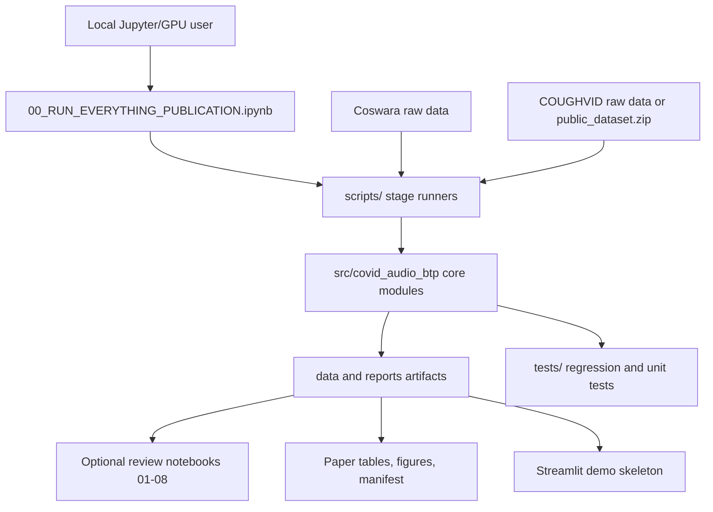
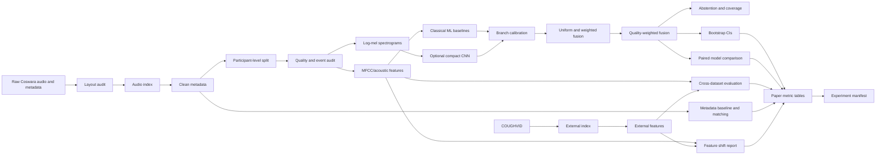
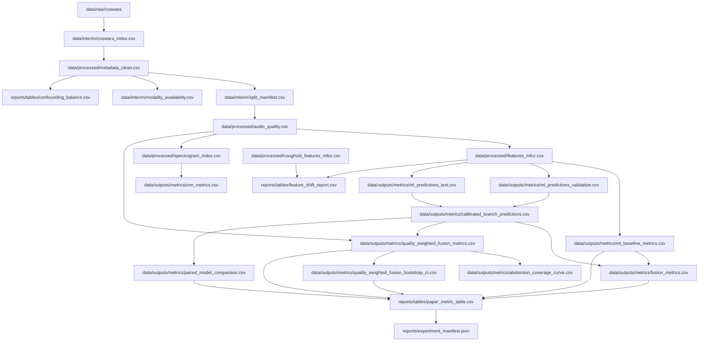
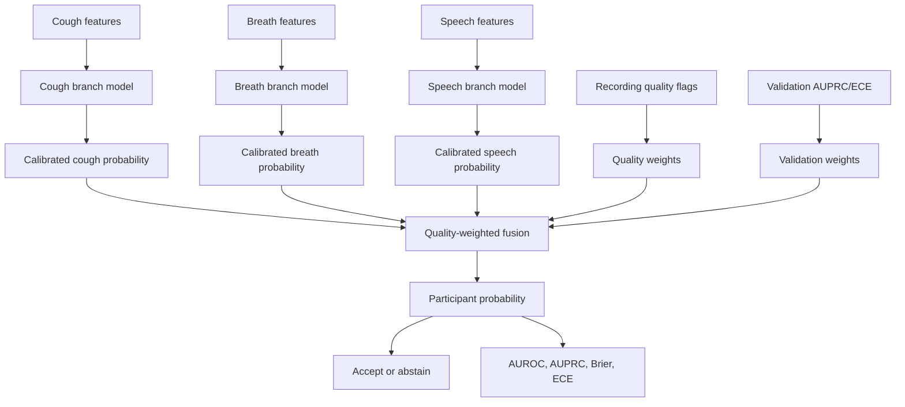
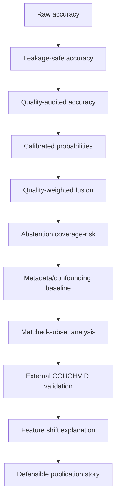

# COVID/Respiratory Audio BTP Master Project Record

Last updated: 2026-05-26
Project path: `/home/ubuntu/nishn_workspce/test_pdfs_generic/.covid_audio_btp_private/covid_audio_btp`
Status: implementation scaffold complete; runtime validation pending on local environment with dependencies and datasets.

## 1. Purpose Of This Master Record

This is the single master document for the project. It consolidates:

- project identity and research direction;
- major chat/decision history in summarized form;
- what we are building and why;
- dataset decisions and inspected schemas;
- code/module/script/notebook map;
- execution workflow;
- publication-strength experiments;
- verification status;
- redundancy audit;
- remaining risks and next actions.

It is not a full verbatim transcript. It records decisions and implementation consequences from the chat so the project can be resumed without relying on model memory.

## 2. Project Identity

Working title:

```text
Reliability-Aware and Confounding-Controlled Evaluation of COVID-19 Respiratory Audio Screening Across Crowdsourced Datasets
```

Short engineering name:

```text
COVID Audio BTP / Q-CalFuse-style respiratory audio reliability study
```

Primary goal:

```text
Build a non-diagnostic research prototype and experimental framework for COVID/respiratory audio screening using cough, breath, and speech audio, with quality-aware preprocessing, participant-level splits, calibrated branch predictions, cautious fusion, abstention, confounding analysis, and cross-dataset validation.
```

Required disclaimer:

```text
Research prototype only. Not a clinical diagnostic tool.
```

Forbidden claims:

- Do not claim clinical diagnosis.
- Do not claim COVID-specific biomarkers without confounding analysis.
- Do not claim mutation/variant/genomic prediction in this audio project.
- Do not claim cross-dataset generalization until COUGHVID/external metrics are actually produced.
- Do not claim high-end publication acceptance before real results, ablations, and reviewer-grade analysis exist.

## 3. User Constraints And Operating Rules

From the chat decisions:

- User wants code/plans generated here, then run locally in Jupyter/GPU environment.
- Persistent project files must stay inside the hidden folder:

```text
/home/ubuntu/nishn_workspce/test_pdfs_generic/.covid_audio_btp_private/covid_audio_btp
```

- Do not put persistent files in `/tmp` or visible root folders.
- Temporary dataset inspection/downloads under `/tmp` are allowed only for schema/code correctness.
- Reapply private permissions after edits:

```bash
chmod -R go-rwx /home/ubuntu/nishn_workspce/test_pdfs_generic/.covid_audio_btp_private
```

- Main local execution should be Jupyter-first.
- User does not want to manually run many notebooks. The project is now single-notebook-first.
- Research scope is audio ML, not biology/wet-lab/genomics.

## 4. Final Workflow Decision

Primary notebook:

```text
notebooks/00_RUN_EVERYTHING_PUBLICATION.ipynb
```

Current cell count:

```text
20 total cells = 10 code + 10 markdown
```

This is the main notebook to run locally.

Optional notebooks:

```text
notebooks/00_MASTER_RUN_ALL.ipynb              core-only legacy runner
notebooks/01_dataset_audit.ipynb              optional review/debug
notebooks/02_quality_review.ipynb             optional review/debug
notebooks/03_feature_review.ipynb             optional review/debug
notebooks/04_ml_baseline_review.ipynb         optional review/debug
notebooks/05_cnn_review.ipynb                 optional review/debug
notebooks/06_calibration_fusion_review.ipynb  optional review/debug
notebooks/07_shift_confounding_review.ipynb   optional review/debug
notebooks/08_publication_grade_experiments.ipynb optional publication extras if not using the single runner
```

The optional notebooks are not required for normal execution. They exist for inspection, debugging, figures, and report review.

## 5. Research Novelty Position

The novelty is not basic “COVID detection from cough”. That area is old and fragile.

The stronger research position is:

```text
A reliability-aware, confounding-controlled, and shift-aware evaluation framework for crowdsourced respiratory audio screening.
```

Main contribution pillars:

1. Quality-first audio pipeline before model training.
2. Participant-level leakage-safe splits.
3. Modality-aware cough/breath/speech handling.
4. Feature selection and compact baseline models.
5. Branch-level calibration before fusion.
6. Quality-weighted calibrated fusion instead of naive averaging.
7. Abstention/coverage analysis for uncertain or low-quality samples.
8. Metadata-only baseline to expose symptom/demographic confounding.
9. Cross-dataset evaluation using COUGHVID.
10. Feature shift diagnostics between source and external datasets.
11. Confounding/matched-subset analysis.
12. Bootstrap confidence intervals and paired model comparison.
13. Reproducibility manifest with package versions and artifact hashes.

## 6. Key Literature/Plan Critiques Addressed

Gemini/LLM critique and our research review identified these issues:

- Quality filtering was too late in the original plan.
- Naive fusion before calibration was mathematically weak.
- Uniform averaging could degrade performance by mixing strong and weak modalities.
- Train/test leakage risk required participant-level splits.
- Missing modalities required explicit handling.
- Metadata/symptom confounding could make audio claims scientifically empty.
- Cross-dataset evaluation must not be treated as trivial plug-and-test.
- Feature selection is needed for high-dimensional MFCC/statistical features.
- External dataset shift must be measured and reported.

Implementation consequences:

- Quality audit happens before feature extraction/modeling.
- Calibration happens before fusion.
- Quality-weighted fusion and validation-weighted fusion exist.
- Metadata-only baseline exists.
- Confounding matching and balance diagnostics exist.
- COUGHVID external validation path exists.
- Feature shift report exists.
- Bootstrap and paired comparison utilities exist.

## 7. Dataset Decisions

### Required Dataset: Coswara

Official source:

```text
https://github.com/iiscleap/Coswara-Data
```

Expected local path:

```text
data/raw/coswara
```

Temporary schema inspection found official metadata columns:

```text
id, a, covid_status, record_date, ep, g, l_c, l_l, l_s, rU, smoker, cold, ht, diabetes,
cough, ctDate, ctScan, ctScore, diarrhoea, fever, loss_of_smell, mp, testType,
test_date, test_status, um, vacc, bd, others_resp, ftg, st, ihd, asthma,
others_preexist, cld, pneumonia
```

Important implemented mappings:

- `id` -> participant ID
- `a` -> age
- `g` -> gender
- `l_c` -> country
- `record_date` -> recording/submission date
- `covid_status` -> label source
- symptom fields -> `symptoms_json`
- comorbidity/risk fields -> `comorbidities_json`
- `testType`, `test_status` retained

Detailed trace:

```text
research_protocol/2026-05-26-dataset-schema-inspection.md
```

### Optional External Dataset: COUGHVID

Primary purpose:

```text
External cough-only validation and dataset-shift analysis.
```

Inspected layout:

```text
public_dataset/<uuid>.json
public_dataset/<uuid>.webm or .ogg
```

Sidecar fields observed:

```text
datetime, cough_detected, latitude, longitude, age, gender,
respiratory_condition, fever_muscle_pain, status
```

Implemented support:

- extracted sidecar directory;
- direct `public_dataset.zip` inspection;
- CSV metadata such as `metadata_compiled.csv`;
- v3-style `status_SSL` field;
- `archive.zip::member` audio loading through temporary materialization.

## 8. Project Layout And Purpose

```text
MASTER_PROJECT_GUIDE.md                 this master record
IMPLEMENTATION_STATUS.md                chronological status log
RUNBOOK_PUBLICATION_GRADE.md            command-level publication workflow
NOTEBOOK_FIRST_RUN_GUIDE.md             Jupyter start guide
LOCAL_GPU_HANDOFF_CHECKLIST.md          local execution checklist
README.md                               compact project summary
requirements.txt                        dependency list
pyproject.toml                          package config

references/verified_source_registry.md source-backed scope/literature guardrail
references/source_plans/                archived planning/literature files
research_protocol/                      protocol addenda and dataset schema inspection

src/covid_audio_btp/                    core library logic
scripts/                                command-line stage runners
notebooks/                              Jupyter orchestration/review notebooks
tests/                                  unit/regression tests
app/app.py                              demo skeleton
```

## 9. Code Map By Responsibility

Core modules:

```text
config.py                 audio/model configuration
schemas.py                expected columns and valid labels/splits
labels.py                 label normalization
data_index.py             Coswara discovery/indexing/metadata extraction
datasets.py               dataset helpers
audio_io.py               audio loading, resampling, zip-member materialization
quality.py                audio quality and active-event audit
preprocess.py             event-aware preprocessing before crop/pad
features.py               MFCC/acoustic feature extraction
feature_selection.py      model feature selection helpers
spectrograms.py           log-mel spectrogram generation
split.py                  participant-level splits and leakage checks
metrics.py                AUROC/AUPRC/Brier/ECE/etc.
models_ml.py              classical baselines
models_cnn.py             compact CNN model
train_cnn.py              CNN training loop
calibration.py            Platt/isotonic/temperature scaling
fusion.py                 uniform, validation-weighted, quality-weighted fusion
metadata.py               metadata cleaning/audit
metadata_baseline.py      metadata/symptom-only baseline
external_datasets.py      COUGHVID indexing
external_features.py      external feature extraction prep
cross_dataset.py          feature harmonization for external eval
statistics.py             bootstrap confidence intervals
abstention.py             uncertainty/quality rejection and coverage curves
model_comparison.py       paired bootstrap model comparisons
confounding.py            coarsened matching and balance diagnostics
shift.py                  source-vs-external feature shift diagnostics
manifest.py               reproducibility manifest with hashes/package versions
reporting.py              figures, outlines, paper metric tables
validation.py             artifact validation gates
notebook_utils.py         Jupyter helpers
```

Script pipeline:

```text
00_check_environment.py
00_inspect_dataset_layout.py
01_build_coswara_index.py
02_clean_metadata.py
03_create_splits.py
04_quality_audit.py
05_extract_features.py
06_train_ml_baselines.py
07_train_cnn.py
08_calibrate_branches.py
09_run_fusion.py
10_shift_and_confounding_checks.py
11_make_report_assets.py
12_validate_artifacts.py
13_build_coughvid_index.py
14_train_metadata_baseline.py
15_bootstrap_prediction_metrics.py
16_run_quality_weighted_fusion.py
17_abstention_analysis.py
18_cross_dataset_feature_eval.py
19_extract_coughvid_features.py
20_make_paper_tables.py
21_paired_model_comparison.py
22_confounding_matching.py
23_feature_shift_report.py
24_make_experiment_manifest.py
```

## 10. Single Notebook Toggles

`notebooks/00_RUN_EVERYTHING_PUBLICATION.ipynb` contains these toggles:

```text
FORCE_REBUILD
RUN_ENV_CHECK
RUN_LAYOUT_AUDIT
RUN_CORE_COSWARA
RUN_FEATURES
RUN_ML_BASELINES
RUN_CALIBRATION
RUN_FUSION
RUN_CNN
RUN_SHIFT_CHECKS
RUN_REPORT_ASSETS
RUN_PUBLICATION_EXTRAS
RUN_METADATA_BASELINE
RUN_QUALITY_WEIGHTED_FUSION
RUN_ABSTENTION
RUN_BOOTSTRAP_CI
RUN_COUGHVID_INDEX
RUN_COUGHVID_FEATURES
RUN_CROSS_DATASET
RUN_PAPER_TABLES
RUN_PAIRED_MODEL_COMPARISON
RUN_CONFOUNDING_MATCHING
RUN_FEATURE_SHIFT_REPORT
RUN_EXPERIMENT_MANIFEST
```

Default intent:

- Run Coswara core first.
- Keep CNN off until CPU/classical path is clean.
- Keep COUGHVID feature extraction off until COUGHVID path is configured.
- Enable publication extras after base artifacts exist.

## 11. Verification Log From This Session

Latest structural verification completed on 2026-05-26:

```text
Python syntax: PASS, 71 Python files checked
Notebook JSON: PASS, 10 notebooks checked
Primary notebook: 00_RUN_EVERYTHING_PUBLICATION.ipynb, 20 cells = 10 code + 10 markdown
No .pyc / __pycache__ files found
Hidden folder permissions: drwx------
```

Runtime test status on this EC2:

```text
pytest: NOT RUN
reason: current EC2 Python lacks pytest, numpy, pandas, librosa, soundfile, sklearn, torch, xgboost
```

Exact dependency check result:

```text
numpy False
pandas False
pytest False
librosa False
soundfile False
sklearn False
torch False
xgboost False
```

Therefore:

```text
Code structure: verified
Notebook structure: verified
Runtime tests: pending local dependency install
Real-data execution: pending local Coswara/COUGHVID run
Publication claims: pending real results
```

## 12. Redundancy Audit

The project does contain multiple documents and notebooks, but they are not all execution requirements.

Primary artifacts:

```text
notebooks/00_RUN_EVERYTHING_PUBLICATION.ipynb
MASTER_PROJECT_GUIDE.md
IMPLEMENTATION_STATUS.md
RUNBOOK_PUBLICATION_GRADE.md
src/covid_audio_btp/
scripts/
tests/
```

Optional/secondary artifacts:

```text
notebooks/00_MASTER_RUN_ALL.ipynb              core-only fallback runner
notebooks/01_*.ipynb through 08_*.ipynb        review/debug/report notebooks
RUNBOOK_STAGE_1.md                             older stage-specific runbook
RUNBOOK_STAGE_2_TO_8.md                        older stage-specific runbook
NOTEBOOK_WORKFLOW.md                           notebook process notes
LOCAL_GPU_HANDOFF_CHECKLIST.md                 local run checklist
```

Archived/reference artifacts:

```text
references/source_plans/*.md
research_protocol/*.md
```

Assessment:

- `00_RUN_EVERYTHING_PUBLICATION.ipynb` is the only required notebook.
- `00_MASTER_RUN_ALL.ipynb` is redundant for normal use but useful as a smaller core-only fallback.
- `01` through `08` are redundant for execution but useful for debugging, figures, and viva/report inspection.
- Old stage runbooks overlap with the publication runbook, but they preserve migration history and are not harmful.
- Source plans are archived evidence, not active instructions.
- No executable Python module/script is currently obviously useless; scripts map to distinct pipeline stages or publication diagnostics.

Recommended future cleanup after first successful local run:

- Keep only `00_RUN_EVERYTHING_PUBLICATION.ipynb` as required.
- Move older runbooks/source plans under an explicit `archive/` folder if the folder feels crowded.
- Do not delete optional review notebooks until after the first real-data run, because they are useful for debugging.

## 13. What Is Complete

Implemented and structurally verified:

- Coswara indexing and metadata extraction.
- Participant-level splits.
- Quality and active-event audit.
- Feature extraction and spectrogram generation.
- Classical ML baselines.
- Compact CNN training path.
- Calibration.
- Standard fusion.
- Quality-weighted fusion.
- Metadata/symptom-only baseline.
- Abstention and coverage curves.
- Bootstrap confidence intervals.
- COUGHVID indexing and external feature extraction path.
- Cross-dataset cough evaluation path.
- Paper metric table generation.
- Paired model comparison.
- Confounding matching and balance diagnostics.
- Feature shift diagnostics.
- Experiment manifest.
- Streamlit demo skeleton.
- Unit/regression tests for core helpers.
- Single main notebook.

## 14. What Is Not Yet Proven

Not yet proven until local execution:

- Actual Coswara folder extraction layout on the user machine.
- Audio codec/read compatibility for every file.
- Runtime correctness under installed dependencies.
- Whether class counts are sufficient in all splits.
- Whether feature extraction is fast enough locally.
- Whether CNN memory/input shapes are stable on GPU.
- Whether COUGHVID external feature extraction is feasible directly from zip or should be extracted first.
- Whether actual metrics are strong enough for a high-end paper.
- Whether confounding/matching weakens or supports the audio claims.
- Whether cross-dataset performance supports generalization or mainly a distribution-shift story.

## 15. Publication Readiness Position

Current status:

```text
Strong BTech implementation scaffold: yes
First full local execution readiness: yes
Structurally publication-oriented: yes
Guaranteed Transactions/high-end acceptance: no
```

A high-end paper will depend on results. The project is built to support a serious paper if one or more of these become true:

1. Quality/calibration/abstention materially improves reliability.
2. Quality-weighted fusion beats naive fusion and best single modality.
3. Metadata-only baseline exposes important confounding and the paper honestly analyzes it.
4. Cross-dataset evaluation gives useful evidence, even if it shows performance collapse under shift.
5. Matched-subset and subgroup results remain defensible.

## 16. Local First Run Commands

```bash
cd /home/ubuntu/nishn_workspce/test_pdfs_generic/.covid_audio_btp_private/covid_audio_btp
python3 -m venv .venv
source .venv/bin/activate
pip install --upgrade pip
pip install -r requirements.txt
pip install -e .
pytest tests -q
jupyter lab
```

Then open:

```text
notebooks/00_RUN_EVERYTHING_PUBLICATION.ipynb
```

## 17. First Run Debugging Contract

If the first run fails, inspect and share:

```text
reports/tables/coswara_layout_audit.csv
reports/tables/validation_issues.csv
data/interim/coswara_index.csv head/columns
data/processed/metadata_clean.csv head/columns
first failing notebook cell output
```

Do not start tuning models before these gates pass:

```text
participant leakage check passes
positive and negative labels both exist
quality audit has acceptable non-corrupt coverage
features_mfcc.csv exists
ml_baseline_metrics.csv exists
```

## 18. Current Best Answer To “Is The Code Complete?”

Accurate answer:

```text
The code is structurally complete for first full local execution and publication-oriented analysis, but it is not scientifically complete until it has been run on real data and the results have been evaluated.
```

## 19. Current Best Answer To “Is It Perfect?”

Accurate answer:

```text
No codebase is perfect before real-data execution. This one is now organized, structurally verified, and materially stronger than a BTech-only scaffold. The remaining uncertainty is empirical, not architectural.
```

## 20. Diagram Index

This section gives visual maps of the project. Mermaid diagrams are included because GitHub/Jupyter/Markdown renderers often support them. If a renderer does not support Mermaid, read the labels as a plain graph.

### 20.1 System Architecture



### 20.2 End-To-End Data Flow



### 20.3 Artifact Dependency Graph



### 20.4 Modeling And Fusion Diagram



### 20.5 Publication Claim Ladder



## 21. Stage-By-Stage Execution Table

| Stage | Script / Notebook Cell | Required Inputs | Main Outputs | Why It Exists | Stop Condition |
|---|---|---|---|---|---|
| Environment | `00_check_environment.py` | installed env | console package check | catch missing dependencies early | any required package missing |
| Raw layout | `00_inspect_dataset_layout.py` | `data/raw/coswara` | `reports/tables/coswara_layout_audit.csv` | verify extraction layout before indexing | no audio or metadata found |
| Index | `01_build_coswara_index.py` | raw Coswara | `data/interim/coswara_index.csv` | one row per recording | missing participant/modality labels |
| Metadata | `02_clean_metadata.py` | index | `metadata_clean.csv`, `modality_availability.csv` | normalize labels and participant metadata | no positive/negative labels |
| Splits | `03_create_splits.py` | metadata | `split_manifest.csv`, metadata with split | participant-level split | participant appears in more than one split |
| Quality | `04_quality_audit.py` | metadata with audio paths | `audio_quality.csv`, metadata with quality | detect corrupt/silent/short/clipped audio | low usable coverage |
| Validation | `12_validate_artifacts.py --strict` | index, metadata, quality | `validation_issues.csv` | hard gate before modeling | any error-level issue |
| Features | `05_extract_features.py` | metadata and audio | `features_mfcc.csv`, `spectrogram_index.csv` | classical and CNN model inputs | empty feature table |
| ML | `06_train_ml_baselines.py` | features | metrics and predictions | baseline models by modality | no train/validation/test rows |
| CNN | `07_train_cnn.py` | spectrogram index | CNN metrics/logits | optional GPU deep baseline | shape/GPU/runtime failure |
| Calibration | `08_calibrate_branches.py` | validation/test predictions | calibrated predictions and metrics | trustworthy probabilities before fusion | no validation predictions |
| Fusion | `09_run_fusion.py` | calibrated predictions, metrics | fusion predictions/metrics | compare uniform and validation-weighted fusion | no modality predictions |
| Subgroups | `10_shift_and_confounding_checks.py` | predictions, metadata | subgroup metrics | inspect bias and reliability | sparse subgroup metrics |
| Report assets | `11_make_report_assets.py` | metadata, predictions | outlines/figures | report/presentation assets | missing predictions for plots |
| COUGHVID index | `13_build_coughvid_index.py` | COUGHVID folder/zip | `coughvid_index.csv` | external validation data source | no labeled cough rows |
| Metadata baseline | `14_train_metadata_baseline.py` | metadata | metadata-only metrics | confounding guardrail | metadata-only beats audio strongly |
| Bootstrap | `15_bootstrap_prediction_metrics.py` | predictions | CI table | uncertainty around metrics | too few samples |
| Quality fusion | `16_run_quality_weighted_fusion.py` | calibrated predictions, quality, metrics | quality-weighted predictions/metrics | main reliability contribution | worse than simple baselines |
| Abstention | `17_abstention_analysis.py` | predictions, metadata | decisions, coverage curve | reject uncertain/low-quality samples | coverage too low |
| Cross dataset | `18_cross_dataset_feature_eval.py` | source/external features | external metrics | generalization check | collapse without explanation |
| External features | `19_extract_coughvid_features.py` | COUGHVID index | external MFCC table | cross-dataset feature input | codec/speed issue |
| Paper tables | `20_make_paper_tables.py` | metric/CI CSVs | `paper_metric_table.csv` | manuscript-ready table | no metrics available |
| Paired comparison | `21_paired_model_comparison.py` | matched predictions | paired difference table | prove improvement over baseline | no matched model rows |
| Confounding matching | `22_confounding_matching.py` | metadata, optional predictions | matched metadata, balance table | test robustness under covariate balance | too few matched rows |
| Feature shift | `23_feature_shift_report.py` | source and external features | shift report/summary | explain cross-dataset drift | missing external features |
| Manifest | `24_make_experiment_manifest.py` | artifacts | manifest JSON | reproducibility record | missing artifacts are recorded, not fatal |

## 22. Artifact Ledger

| Artifact | Produced By | Consumed By | Meaning |
|---|---|---|---|
| `reports/tables/coswara_layout_audit.csv` | `00_inspect_dataset_layout.py` | user/review notebooks | file layout and sample of audio/metadata paths |
| `data/interim/coswara_index.csv` | `01_build_coswara_index.py` | metadata cleaning, validation | raw recording index with inferred modality/labels |
| `data/processed/metadata_clean.csv` | `02_clean_metadata.py`, updated by split/quality | most later stages | canonical per-recording metadata |
| `data/interim/modality_availability.csv` | `02_clean_metadata.py` | review/report | participant modality coverage |
| `data/interim/split_manifest.csv` | `03_create_splits.py` | validation/review | participant-level split assignment |
| `data/processed/audio_quality.csv` | `04_quality_audit.py` | feature extraction, fusion, abstention | audio quality and event-region diagnostics |
| `reports/tables/validation_issues.csv` | `12_validate_artifacts.py` | notebook hard gate | errors/warnings before modeling |
| `data/processed/features_mfcc.csv` | `05_extract_features.py` | ML, cross-dataset, shift | handcrafted acoustic features |
| `data/processed/spectrogram_index.csv` | `05_extract_features.py` | CNN | saved log-mel spectrogram table |
| `data/outputs/metrics/ml_baseline_metrics.csv` | `06_train_ml_baselines.py` | paper tables, fusion weights | classical baseline metrics |
| `data/outputs/metrics/ml_predictions_validation.csv` | `06_train_ml_baselines.py` | calibration | validation predictions for fitting calibrators |
| `data/outputs/metrics/ml_predictions_test.csv` | `06_train_ml_baselines.py` | calibration | test predictions to calibrate/evaluate |
| `data/outputs/metrics/calibrated_branch_predictions.csv` | `08_calibrate_branches.py` | fusion, paired comparison | calibrated branch probabilities |
| `data/outputs/metrics/fusion_predictions.csv` | `09_run_fusion.py` | subgroup checks, report assets | uniform/validation-weighted fusion predictions |
| `data/outputs/metrics/fusion_metrics.csv` | `09_run_fusion.py` | paper tables | fusion metrics |
| `data/outputs/metrics/quality_weighted_fusion_predictions.csv` | `16_run_quality_weighted_fusion.py` | abstention, bootstrap, matching metrics | reliability-aware fused predictions |
| `data/outputs/metrics/quality_weighted_fusion_metrics.csv` | `16_run_quality_weighted_fusion.py` | paper tables | main proposed fusion metrics |
| `data/outputs/metrics/abstention_coverage_curve.csv` | `17_abstention_analysis.py` | paper figures/tables | coverage-vs-performance tradeoff |
| `data/interim/coughvid_index.csv` | `13_build_coughvid_index.py` | external feature extraction | external cough index |
| `data/processed/coughvid_features_mfcc.csv` | `19_extract_coughvid_features.py` | cross-dataset eval, shift | external cough feature table |
| `data/outputs/metrics/cross_dataset_metrics.csv` | `18_cross_dataset_feature_eval.py` | paper tables | external validation metrics |
| `reports/tables/feature_shift_report.csv` | `23_feature_shift_report.py` | paper discussion | source-vs-external feature drift ranking |
| `reports/tables/confounding_balance.csv` | `22_confounding_matching.py` | paper methods/results | matched subset covariate balance |
| `reports/tables/paper_metric_table.csv` | `20_make_paper_tables.py` | paper/report | final formatted metric table |
| `reports/experiment_manifest.json` | `24_make_experiment_manifest.py` | reproducibility appendix | config, package versions, artifact hashes |

## 23. Single Notebook Cell Map

`00_RUN_EVERYTHING_PUBLICATION.ipynb` currently has 20 cells.

| Cell Group | Type | Purpose |
|---|---|---|
| Title | markdown | explains this is the single primary workflow |
| Imports/root setup | code | sets `PROJECT_ROOT`, Python path, working dir |
| Configuration | markdown/code | all user-editable toggles and dataset paths |
| Runner helper | markdown/code | defines skip/rebuild script runner |
| Artifact dashboard | markdown/code | shows existing artifacts before execution |
| Stage 0-1 | markdown/code | environment, layout, index, metadata, splits, quality, validation |
| Hard gate | markdown/code | checks labels, leakage, validation, quality coverage |
| Stage 2-5 | markdown/code | features, ML, CNN, calibration, fusion, subgroup/report assets |
| Stage 6 | markdown/code | metadata baseline, quality fusion, abstention, bootstrap, COUGHVID, paper tables |
| Stage 7 | markdown/code | paired comparison, matching, feature shift, manifest |
| Final dashboard | markdown/code | displays produced outputs and key tables |

Default run plan:

1. Set `RAW_COSWARA_DIR`.
2. Keep `RUN_CNN = False` for the first clean CPU run.
3. Keep COUGHVID toggles false until Coswara succeeds.
4. Run all cells.
5. Fix any gate failures before modeling claims.
6. Enable CNN/COUGHVID after baseline pipeline is stable.

## 24. Research Experiment Matrix

| Experiment | Question | Input | Output | Paper Use |
|---|---|---|---|---|
| All-sample baseline | Can audio features predict labels under leakage-safe split? | `features_mfcc.csv` | ML metrics | baseline table |
| Quality-filtered sensitivity | Does quality filtering improve reliability? | metadata + quality | quality mode metrics | ablation table |
| Single modality | Which modality is strongest? | branch predictions | modality metrics | model comparison |
| Uniform fusion | Does naive fusion help or hurt? | calibrated predictions | fusion metrics | negative/positive baseline |
| Validation-weighted fusion | Does validation-informed weighting help? | calibrated predictions + val metrics | fusion metrics | fusion ablation |
| Quality-weighted fusion | Does proposed reliability-aware weighting help? | predictions + quality + val metrics | main fusion metrics | main contribution |
| Calibration | Does ECE/Brier improve? | raw and calibrated predictions | calibration metrics | reliability evidence |
| Abstention | Can uncertain/low-quality samples be rejected? | fused predictions | coverage curve | deployment caution |
| Metadata baseline | Are symptoms/demographics strong predictors? | metadata | metadata metrics | confounding guardrail |
| Matched subset | Do claims survive covariate balancing? | metadata + predictions | matched metrics/balance | reviewer defense |
| COUGHVID external | Does a Coswara-trained model generalize? | Coswara features + COUGHVID features | external metrics | external validity |
| Feature shift | Why does external performance change? | source/external features | shift report | distribution-shift explanation |
| Paired comparison | Is one model materially better? | matched predictions | difference CI | statistical comparison |
| Bootstrap CIs | How uncertain are reported metrics? | predictions | metric CIs | paper confidence intervals |
| Manifest | Can results be reproduced? | artifacts/config | manifest JSON | reproducibility appendix |

## 25. Model Families And Roles

| Model/Method | Role | Why Included | Publication Interpretation |
|---|---|---|---|
| Dummy most frequent | sanity baseline | ensures class imbalance is visible | real models must beat it |
| Dummy stratified | sanity baseline | random baseline under label distribution | real models must beat it |
| Logistic regression | simple interpretable baseline | stable with tabular features | strong baseline for small data |
| Random forest | nonlinear tabular baseline | captures feature interactions | compare against linear model |
| XGBoost | strong tabular baseline | common high-performing baseline | use cautiously on small data |
| Compact CNN | spectrogram deep baseline | checks whether learned spectrogram features help | optional GPU branch |
| Metadata logistic baseline | confounding baseline | tests if non-audio metadata predicts labels | crucial honesty check |
| Uniform fusion | naive multimodal baseline | tests if averaging helps | may degrade due modality asymmetry |
| Validation-weighted fusion | less naive fusion | weights stronger branches more | stronger baseline than uniform |
| Quality-weighted fusion | proposed reliability-aware method | combines validation strength and recording quality | main method candidate |
| Abstention | reliability layer | rejects uncertain/low-quality cases | safety/reliability analysis |

## 26. Data Schema Reference

### 26.1 Canonical Recording Metadata

Expected important columns in `metadata_clean.csv`:

```text
participant_id
recording_id
dataset
modality
submodality
audio_path
label_raw
label_binary
recording_date
age
gender
country
symptoms_json
comorbidities_json
test_status
test_type
manual_quality_score
manual_quality_label
split
quality_flag
```

### 26.2 Valid Labels

```text
positive
negative
unknown
```

Only `positive` and `negative` are used for supervised metric evaluation. `unknown` rows are useful for indexing/inspection but excluded from binary metrics.

### 26.3 Valid Splits

```text
train
validation
test
external
unused
```

Rules:

- A participant must not appear in more than one of `train`, `validation`, `test`.
- External datasets must use `external`, not Coswara train/test splits.
- Unknown labels should not silently enter supervised training.

### 26.4 Modalities

```text
cough
breath
speech
unknown
```

Common submodalities:

```text
heavy_cough
shallow_cough
deep_breath
shallow_breath
counting_fast
counting_normal
vowel_a
vowel_e
vowel_o
```

## 27. Quality Audit Logic

Quality audit exists because crowdsourced respiratory audio is noisy and can easily produce false performance.

Quality dimensions include:

- unreadable/corrupt audio;
- very short duration;
- silence or mostly silence;
- clipping;
- low active-audio ratio;
- spectral outliers;
- event start/end and duration;
- manual quality score/label when dataset provides it.

Quality outputs are used in three ways:

1. As a hard pre-modeling audit.
2. As optional filtering/sensitivity analysis.
3. As weights in quality-weighted fusion and abstention.

Important principle:

```text
Quality is evaluated before training, not after models are already built.
```

## 28. Calibration And Fusion Details

Calibration methods implemented:

```text
platt
isotonic
temperature
```

Default method:

```text
platt
```

Reason:

- Works with probabilities from classical models.
- Does not require neural logits.
- Safer default for first local run.

Fusion methods:

| Method | Formula Concept | Risk |
|---|---|---|
| uniform mean | average available branch probabilities | weak modalities can drag down strong branch |
| validation-weighted | weight by validation metric, usually AUPRC | can overtrust noisy validation if sample small |
| quality-weighted | validation weight multiplied by quality weight | depends on quality audit accuracy |

Quality-weighted fusion principle:

```text
branch weight = max(validation_metric - 0.5, floor) * quality_weight
```

Missing modalities are ignored and weights are renormalized.

## 29. Statistical Reporting Plan

Metrics:

```text
AUROC
AUPRC
balanced accuracy
F1
sensitivity
specificity
Brier score
ECE
NLL
coverage for abstention
```

Uncertainty:

```text
bootstrap confidence intervals
paired bootstrap model differences
```

Paper tables should avoid naked point estimates. Preferred format:

```text
0.812 [0.700, 0.900]
```

Recommended result tables:

1. Dataset summary table.
2. Quality audit summary table.
3. Main model metrics table.
4. Calibration table.
5. Fusion ablation table.
6. Abstention coverage-risk table.
7. Metadata baseline/confounding table.
8. Matched subset balance table.
9. Cross-dataset external validation table.
10. Feature shift top-20 table.

## 30. Paper Figure Plan

Recommended figures:

1. End-to-end pipeline diagram.
2. Dataset/modality availability bar chart.
3. Quality flag distribution by modality and label.
4. Feature correlation or feature importance summary.
5. Reliability diagram before/after calibration.
6. Fusion comparison bar chart with CIs.
7. Abstention coverage-vs-performance curve.
8. Metadata baseline vs audio baseline comparison.
9. Cross-dataset performance drop chart.
10. Feature shift top features chart.

Current code support:

- Basic class distribution plot exists.
- Reliability diagram exists.
- Tables exist for many figures.
- More polished plotting can be added after real results exist.

## 31. Paper Outline

Suggested manuscript structure:

1. Title and non-clinical framing.
2. Abstract.
3. Introduction.
4. Related work.
5. Dataset and ethics.
6. Problem setup.
7. Quality-first preprocessing.
8. Feature extraction and model baselines.
9. Calibration and fusion.
10. Confounding and metadata baselines.
11. Cross-dataset validation and shift diagnostics.
12. Results.
13. Discussion.
14. Limitations.
15. Conclusion.
16. Reproducibility statement.

Potential title:

```text
Reliability-Aware and Confounding-Controlled Evaluation of Respiratory Audio Screening Across Crowdsourced COVID-19 Datasets
```

Potential contribution statement:

```text
We present a leakage-safe, quality-aware, calibrated evaluation framework for crowdsourced respiratory audio screening, and show how quality, calibration, metadata confounding, abstention, and external dataset shift affect apparent COVID-19 audio classification performance.
```

## 32. Reviewer Question Defense Map

| Reviewer Question | Where The Project Answers It |
|---|---|
| Did you leak participants across splits? | `split.py`, `03_create_splits.py`, notebook hard gate |
| Did you train before quality filtering? | quality audit before features/modeling |
| Are probabilities calibrated? | `calibration.py`, ECE/Brier/NLL metrics |
| Is fusion just naive averaging? | uniform baseline plus validation/quality-weighted alternatives |
| What if metadata/symptoms explain the labels? | metadata baseline and confounding matching |
| Does it generalize to another dataset? | COUGHVID external validation path |
| Why does external performance drop? | feature shift diagnostics |
| Are improvements statistically meaningful? | bootstrap CIs and paired bootstrap comparisons |
| Can results be reproduced? | experiment manifest with hashes and package versions |
| Is this a diagnostic tool? | required disclaimer and forbidden claims |

## 33. Decision Log

| Date | Decision | Reason | Implementation Consequence |
|---|---|---|---|
| 2026-05-24 | Focus on audio project, not mutation prediction | safety/scope and BTech feasibility | source registry excludes genomics |
| 2026-05-24 | Use hidden persistent folder | user privacy requirement | `.covid_audio_btp_private/covid_audio_btp` |
| 2026-05-24 | Use notebook-first but module-backed design | user will run locally in Jupyter | core logic in `src`, orchestration in notebooks |
| 2026-05-24 | Quality audit before modeling | avoids late rework and invalid metrics | scripts `04` before `05/06/07` |
| 2026-05-24 | Participant-level split | prevent leakage | `split.py`, hard gate |
| 2026-05-24 | Calibration before fusion | averaging raw probabilities is weak | script `08` before `09/16` |
| 2026-05-25 | Add publication-grade extras | professor wants high-end paper possibility | scripts `13` through `18` |
| 2026-05-26 | Inspect real Coswara/COUGHVID schemas | avoid hallucinated dataset assumptions | dataset schema report and adapter patches |
| 2026-05-26 | Single-notebook-first | user does not want multiple required notebooks | `00_RUN_EVERYTHING_PUBLICATION.ipynb` |
| 2026-05-26 | Add paired comparison/matching/shift/manifest | strengthen publication evidence | scripts `21` through `24` |
| 2026-05-26 | Expand master guide | user requested everything in one master doc | this master record |

## 34. Redundancy And Cleanup Policy

Do not delete optional notebooks or archived plans before the first successful real-data run.

Reason:

- Optional notebooks are useful when the single notebook fails or produces suspicious metrics.
- Source plans preserve research rationale and can help write the report.
- Older runbooks help debug stage-specific command issues.

After a successful local run, safe cleanup options:

1. Move `references/source_plans/` into `archive/source_plans/`.
2. Move `RUNBOOK_STAGE_1.md` and `RUNBOOK_STAGE_2_TO_8.md` into `archive/runbooks/`.
3. Keep all `src/`, `scripts/`, `tests/`, and the primary notebook.
4. Keep optional review notebooks until paper figures are finalized.

Current redundancy status:

```text
Execution redundancy: low, because one notebook is primary.
Documentation redundancy: moderate, intentional until first real run.
Code redundancy: acceptable; scripts map to distinct artifacts/experiments.
```

## 35. Local Run Modes

### 35.1 First CPU Sanity Run

Toggles:

```python
RUN_CNN = False
RUN_COUGHVID_INDEX = False
RUN_COUGHVID_FEATURES = False
RUN_CROSS_DATASET = False
RUN_FEATURE_SHIFT_REPORT = False
FORCE_REBUILD = False
```

Goal:

```text
Get Coswara index, quality audit, features, classical ML, calibration, fusion, and paper tables working.
```

### 35.2 GPU CNN Run

Toggles:

```python
RUN_CNN = True
CNN_EPOCHS = 50
CNN_BATCH_SIZE = 32
```

Goal:

```text
Add spectrogram CNN baseline after classical path is stable.
```

### 35.3 COUGHVID Smoke Test

Toggles:

```python
COUGHVID_RAW = Path("/path/to/public_dataset.zip")
RUN_COUGHVID_INDEX = True
RUN_COUGHVID_FEATURES = True
COUGHVID_FEATURE_MAX_ROWS = 25
RUN_CROSS_DATASET = False
```

Goal:

```text
Verify external indexing/audio decoding before full feature extraction.
```

### 35.4 Full External Validation

Toggles:

```python
RUN_COUGHVID_FEATURES = True
COUGHVID_FEATURE_MAX_ROWS = None
RUN_CROSS_DATASET = True
RUN_FEATURE_SHIFT_REPORT = True
```

Goal:

```text
Run external evaluation and explain distribution shift.
```

## 36. Troubleshooting Guide

| Symptom | Likely Cause | Fix |
|---|---|---|
| `Coswara not found` | wrong raw path | set `RAW_COSWARA_DIR` in notebook |
| zero audio files | archives not extracted or wrong folder level | inspect `coswara_layout_audit.csv` |
| all labels unknown | metadata not found or label mapping issue | inspect `coswara_index.csv` columns |
| participant leakage failure | split merge issue or duplicated participant handling | inspect `split_manifest.csv` |
| many corrupt files | codec/read issue or bad extraction | install `ffmpeg`, check `soundfile/librosa` |
| feature extraction slow | direct zip/excessive files | run smoke test, then full local extracted data |
| no validation predictions | ML training skipped/failed | inspect script `06` output |
| calibration fails | missing validation/test predictions | rerun ML baselines |
| fusion empty | no calibrated branch predictions | rerun calibration |
| COUGHVID feature extraction fails | webm/ogg codec issue | extract archive and install audio backend/ffmpeg |
| cross-dataset metrics poor | real distribution shift | use feature shift report, do not hide result |
| metadata baseline strong | confounding likely | report honestly and run matching analysis |

## 37. Test Plan

Local after dependency install:

```bash
pytest tests -q
```

Test files:

```text
test_labels.py                      label normalization
test_split.py                       participant splits/leakage
test_quality.py                     audio quality helpers
test_features.py                    feature extraction helpers
test_metrics.py                     metric calculations
test_calibration.py                 calibration helpers
test_data_index.py                  Coswara indexing and real short columns
test_notebook_utils.py              notebook artifact helpers
test_publication_layer.py           COUGHVID/fusion/bootstrap/metadata baseline helpers
test_publication_strengthening.py   paired comparison, matching, shift, manifest
```

Expected before local dependency install:

```text
Tests cannot run if numpy/pandas/pytest/librosa/soundfile/sklearn are missing.
```

## 38. Result Interpretation Rules

If quality-weighted fusion beats uniform fusion:

```text
Claim reliability-aware weighting improved performance on this split, with CI.
```

If quality-weighted fusion does not beat best single modality:

```text
Report that multimodal fusion did not improve over the strongest branch; emphasize reliability analysis rather than accuracy gain.
```

If metadata baseline is close to audio:

```text
Do not claim audio-specific COVID detection. Frame as evidence of confounding risk in crowdsourced datasets.
```

If external validation collapses:

```text
Use feature shift diagnostics and discuss dataset/hardware/collection drift. This can still be publishable as a negative external-validity finding.
```

If matched-subset performance collapses:

```text
Report that unbalanced cohort factors inflated apparent performance.
```

If confidence intervals are wide:

```text
Avoid strong claims; report limited sample size and uncertainty.
```

## 39. Minimum Publishable Evidence Package

Before writing a serious paper, generate these artifacts:

```text
reports/tables/dataset_audit.csv
reports/tables/quality_summary.csv
data/outputs/metrics/ml_baseline_metrics.csv
data/outputs/metrics/calibration_metrics.csv
data/outputs/metrics/fusion_metrics.csv
data/outputs/metrics/quality_weighted_fusion_metrics.csv
data/outputs/metrics/abstention_coverage_curve.csv
data/outputs/metrics/quality_weighted_fusion_bootstrap_ci.csv
data/outputs/metrics/metadata_baseline_metrics.csv
reports/tables/confounding_balance.csv
data/outputs/metrics/paired_model_comparison.csv
reports/tables/paper_metric_table.csv
reports/experiment_manifest.json
```

For stronger external-validity paper:

```text
data/interim/coughvid_index.csv
data/processed/coughvid_features_mfcc.csv
data/outputs/metrics/cross_dataset_metrics.csv
reports/tables/feature_shift_report.csv
reports/tables/feature_shift_summary.csv
```

## 40. Demo/App Position

Current app:

```text
app/app.py
```

Role:

```text
Demonstration skeleton, not the scientific core.
```

Expected demo features:

- upload audio;
- show waveform;
- show quality flag;
- show active event region;
- show spectrogram;
- optionally load trained model after local training;
- always show non-clinical research disclaimer.

Do not let the app drive the research methodology. The paper must be based on saved artifacts and validated scripts, not demo screenshots.

## 41. File Ownership And Edit Policy

Primary files to modify during future work:

```text
src/covid_audio_btp/*.py
scripts/*.py
notebooks/00_RUN_EVERYTHING_PUBLICATION.ipynb
MASTER_PROJECT_GUIDE.md
IMPLEMENTATION_STATUS.md
RUNBOOK_PUBLICATION_GRADE.md
```

Files to treat as archives unless there is a reason:

```text
references/source_plans/*.md
research_protocol/2026-05-25-*.md
```

Files generated by local runs should remain under:

```text
data/
reports/
```

Do not put local generated artifacts in the visible workspace root.

## 42. Current Open Questions

These cannot be answered until local execution:

1. How many usable Coswara positive/negative participants remain after quality audit?
2. Which modality is strongest: cough, breath, or speech?
3. Does calibration improve ECE/Brier materially?
4. Does quality-weighted fusion beat uniform fusion and best single branch?
5. Does abstention improve performance at acceptable coverage?
6. Does metadata-only baseline rival audio models?
7. Does matched-subset analysis preserve performance?
8. Does COUGHVID external validation work or collapse?
9. Which features shift most between Coswara and COUGHVID?
10. Are results strong enough for a high-end venue, or better framed as a rigorous BTech/reliability study?

## 43. Final One-Page Mental Model

```text
Raw respiratory audio is messy.
Messy data can fake good COVID audio results.
So this project audits quality first, splits by participant, trains baseline audio models, calibrates probabilities, fuses cautiously, rejects uncertain/low-quality cases, compares against metadata-only confounding baselines, tests matched subsets, and checks external dataset shift.

The scientific value is not just a classifier. The value is the reliability and validity analysis around the classifier.
```

