# COVID Audio BTP End-to-End Professor Brief

This document is a discussion guide for explaining the complete COVID respiratory-audio project to a professor who wants reputable venues, strong numbers, and a clear implementation story. All paths are relative to `covid_audio_btp/` unless stated otherwise.

The safest project sentence is:

> We built a multimodal COVID respiratory-audio benchmark pipeline with strong internal performance, then showed through temporal validation, metadata-confounding audits, calibration, and COUGHVID transfer that high internal respiratory-audio scores are not reliable evidence of deployable screening performance.

This is not a pure leaderboard/SOTA paper. The internal result is strong (`0.897` AUROC), but the scientific contribution is the evidence chain showing why that number is not enough.

## One-Minute Thesis

Public COVID-audio studies often report high internal metrics, but the real question is whether those models survive realistic validation. Our work builds a strong multimodal respiratory-audio pipeline on Coswara using cough, breath, and speech; improves the handcrafted feature branch with OpenSMILE ComParE 2016 and IS10 descriptors; evaluates many classical, ensemble, deep, and transformer branches; and then stress-tests the final pipeline under stricter validation.

The final story is:

- Internal participant-split fusion reaches `0.897` AUROC and `0.863` AUPRC.
- Time-stratified participant validation remains high but lower at `0.849` AUROC.
- Early-to-late temporal validation drops to about `0.698` AUROC, with multi-seed temporal mean around `0.691 +/- 0.006`.
- COUGHVID external transfer collapses to near-random performance: handcrafted cough models `0.523-0.543` AUROC, WavLM transformer `0.484` AUROC, CNN-BiGRU `0.548` AUROC.
- Metadata-only models predict COVID labels extremely well (`0.964` AUROC for full safe metadata, `0.932` for symptoms-only), and shuffle-label sanity checks drop to chance (`~0.50`), confirming the shortcut is real dataset structure rather than a software bug.
- Feature-selection stability over time is very low: top-800 early vs late acoustic features have Jaccard overlap `0.074`.

The professor-facing framing:

> The paper should not say "we failed to beat SOTA." It should say "we built a strong pipeline, then proved that common high internal COVID-audio scores are not sufficient because they depend on collection context, calendar time, and dataset protocol."

## Primary Source Files

| Area | Main files |
|---|---|
| Strong handcrafted/audio baseline | `src/covid_audio_btp/strong_baseline.py`, `src/covid_audio_btp/strong_features.py`, `scripts/49_extract_strong_features.py` |
| OpenSMILE ComParE+IS10 rescue branch | `scripts/56_run_compare_is10_rescue.py`, `src/covid_audio_btp/compare_is10_rescue.py`, `src/covid_audio_btp/opensmile_features.py` |
| Final validation ladder | `scripts/58_run_compare_is10_final_validation.py`, `src/covid_audio_btp/compare_is10_final_validation.py`, `reports/tables/compare_is10_final_validation_summary.csv` |
| Paper-comparable 10-fold CV | `scripts/57_run_paper_comparable_cv.py`, `reports/tables/paper_comparable_cv_metric_table.csv` |
| WavLM transformer and CNN-BiGRU external transfer | `scripts/62_run_deep_coughvid_external_transfer.py`, `src/covid_audio_btp/sota_ssl.py`, `src/covid_audio_btp/train_cnn.py` |
| Reviewer evidence checks | `scripts/59_run_final_uncertainty_calibration.py` through `scripts/68_run_incremental_audio_metadata_value.py`, `src/covid_audio_btp/reviewer_evidence.py`, `src/covid_audio_btp/reviewer_extension_checks.py` |
| Metadata confounding | `src/covid_audio_btp/metadata_confounding.py`, `src/covid_audio_btp/metadata_permutation_importance.py`, `reports/tables/metadata_confounding_*.csv` |
| Reporting and manifest | `scripts/20_make_paper_tables.py`, `scripts/24_make_experiment_manifest.py`, `reports/experiment_manifest.json` |

## End-to-End Pipeline

```mermaid
flowchart LR
    A["Coswara raw audio\ncough + breath + speech"] --> B["Metadata and quality audit\nlabels, participant ids, quality flags"]
    B --> C["Audio preprocessing\nload, resample, normalize, event-aware feature prep"]
    C --> D["Feature extraction\nstrong acoustic + OpenSMILE ComParE2016 + IS10"]
    D --> E["Merged feature bank\n~10k columns"]
    E --> F["Train-only feature selection\nLightGBM top-800"]
    F --> G["Model bank\nLightGBM, CatBoost, XGBoost, SVC,\nensembles, stacking"]
    G --> H["Validation ladder\nexisting split, time-stratified split,\nearly-to-late temporal split"]
    H --> I["External transfer\nCOUGHVID cough-only"]
    H --> J["Reviewer audits\nCI, calibration, DCA, shuffle, subgroups,\nsupport overlap, feature stability"]
    I --> J
    J --> K["Manuscripts and professor evidence docs"]
```



## What Happens at Each Stage

### 1. Dataset and labels

The source dataset is Coswara, using respiratory modalities:

- cough
- breath
- speech

The external dataset is COUGHVID. COUGHVID is cough-only, so it is used as an external cough-transfer stress test, not as a full multimodal external validation. This limitation must be stated clearly.

Label handling:

- Coswara analytic labels come from the processed `label_binary` column after the repository mapping.
- COUGHVID analytic labels come from the processed external metadata `label_binary` column.
- The two datasets are not assumed to have clinically identical label-construction procedures.
- Therefore, the external-transfer result is interpreted as real-world dataset transfer failure affected by acoustic shift, collection-protocol shift, and label-definition mismatch.

### 2. Quality control and artifact validation

The repository validates core artifacts with:

```bash
python scripts/12_validate_artifacts.py \
  --index data/interim/coswara_index.csv \
  --metadata data/processed/metadata_with_quality.csv \
  --quality data/processed/audio_quality.csv \
  --strict
```

The current validation warning is:

```text
warning unknown_labels 5688 rows have unknown labels
```

That warning is expected for rows not used in supervised binary evaluation. It is not a fatal leakage or split error.

### 3. Acoustic feature extraction

We used three handcrafted/acoustic feature groups:

| Feature group | What it contains | Why used |
|---|---|---|
| Strong acoustic bank | MFCC, delta MFCC, delta-delta MFCC, mel-band summaries, chroma, spectral contrast, tonnetz, RMS, zero-crossing rate, spectral centroid, bandwidth, rolloff, flatness, tempogram, duration and waveform statistics | A broad respiratory-audio feature bank that captures timbre, frequency, energy, and temporal properties |
| OpenSMILE ComParE 2016 | Large paralinguistic acoustic descriptor set | Common in speech/cough challenge-style audio papers; adds established high-dimensional descriptors |
| OpenSMILE IS10 | INTERSPEECH 2010 paralinguistic descriptor set | Smaller established descriptor set; complementary to ComParE |

The ComParE+IS10 merged table has about `10,147` columns before selection. Because this is much larger than the number of participants, we did not feed all features directly into final models. We selected the top `800` features using train-only LightGBM feature importance.

### 4. Feature selection

Main final feature strategy:

```text
compare_is10_top800_lightgbm
```

Important details:

- Feature selection is done on training data only.
- Default top-k values explored: `500`, `800`, `1200`.
- Final selected setting: top `800`.
- Ranker: LightGBM.
- Selection scope: per-modality mean, so cough, breath, and speech do not get swallowed by one dominant modality.

Why not use all 10k features? Because 10k features on a limited participant set is high-risk for overfitting. The top-800 branch is a bounded, defensible compromise: strong enough to improve internal performance, but controlled enough to discuss scientifically.

### 5. Model bank

The main non-deep model families:

| Model | Purpose |
|---|---|
| LightGBM + SMOTE-style feature route | Strong tabular learner for high-dimensional acoustic features |
| CatBoost + SMOTE-style feature route | Robust boosted-tree branch that handles non-linear feature interactions |
| XGBoost + SMOTE-style feature route | Independent boosted-tree family for consistency checks |
| RBF SVC | Non-tree non-linear baseline; useful to show results are not tree-specific |
| Uniform mean fusion | Simple probability averaging |
| Validation-weighted fusion | Weights modalities/models by validation behavior |
| Stacked logistic validation fusion | Learns a small meta-model on validation predictions |

Deep/model-representation branches:

| Model | What it proves |
|---|---|
| WavLM base-plus | Yes, we used a transformer. It is a self-supervised speech transformer, fine-tuned on cough segments. |
| CNN-BiGRU spectrogram model | Neural spectrogram route independent of handcrafted features |
| BEATs/PANNs earlier representation work | Representation-shift/domain evidence from pretrained audio feature families |

Nature-inspired/swarm branch:

- Particle swarm optimization (PSO) feature search was implemented and tested.
- It did not become the final claim because it did not solve the external/temporal reliability problem.
- It should be described as an attempted feature-selection branch, not as the main novelty.

### 6. Multimodal fusion

Coswara has multiple respiratory modalities, so multimodal fusion is meaningful internally:

- cough + speech
- cough + breath + speech
- breath + speech
- individual modality models

How multimodal is achieved:

1. Train/evaluate modality or submodality branches.
2. Produce participant-level probabilities.
3. Fuse probabilities when the same participant has multiple available modalities.
4. Select/fuse based on validation behavior only.

Important limitation:

> COUGHVID is cough-only, so it cannot externally validate the full cough+breath+speech fusion. It can only test whether the cough branch transfers to an independent cough dataset.

This does not invalidate the multimodal Coswara result; it limits the external claim.

### 7. Validation ladder

The final paper should emphasize a validation ladder:

| Tier | What it tests | Main result |
|---|---|---:|
| Existing participant split | Strong internal performance under the repository split | `0.897` AUROC |
| Time-stratified participant split | Participant separation with time structure considered | `0.849` AUROC |
| Early-to-late temporal split | Whether the model survives calendar drift | `0.698` AUROC |
| COUGHVID external cough transfer | Whether cough representations survive another dataset | `0.523-0.543` AUROC for handcrafted, `0.484` WavLM, `0.548` CNN-BiGRU |

The key interpretation:

> The model can perform well inside Coswara, but the signal is not stable enough for external deployment claims.

## Final Headline Results

| Result block | Number | Meaning |
|---|---:|---|
| Existing participant split | `0.897` AUROC, `0.863` AUPRC | Strong internal multimodal performance |
| Time-stratified split | `0.849` AUROC, `0.783` AUPRC | Still strong, but lower |
| Early-to-late temporal split | `0.698` AUROC | Temporal drift damages performance |
| COUGHVID external handcrafted cough | `0.523-0.543` AUROC | Near-random external transfer |
| WavLM transformer external cough | `0.484` AUROC | Transformer does not solve dataset shift |
| CNN-BiGRU external cough | `0.548` AUROC | Deep spectrogram branch also weak externally |
| Full metadata-only shortcut | `0.964` AUROC | Context/metadata strongly predicts labels |
| Symptoms-only metadata | `0.932` AUROC | Symptom fields alone are strong predictors |
| Metadata shuffle sanity | `~0.50` AUROC | High metadata result is real structure, not leakage bug |
| Feature stability early vs late | `0.074` Jaccard | Selected acoustic features are non-stationary |
| Domain support outside source | `25.2%` external outside support band | COUGHVID partly lies outside Coswara feature support |

## How to Explain This to the Professor

Use this if she asks, "What is the achievement if not SOTA?"

```text
Ma'am, the strongest internal model reaches 0.897 AUROC, so the pipeline is not weak internally. The main contribution is that we then tested whether this performance survives realistic conditions. Under temporal and external validation, the performance drops sharply, and the same collapse appears for handcrafted models, WavLM transformer, and CNN-BiGRU. This is stronger than simply reporting one high number because it tells reviewers what is actually deployable and what is only an internal benchmark artifact.
```

If she asks, "Why should a good journal accept this?"

```text
Because reputable biomedical AI journals increasingly care about external validation, calibration, shortcut learning, and deployment safety. We have a complete evidence chain: internal performance, temporal validation, external transfer, confidence intervals, calibration, decision-curve analysis, metadata shortcut audits, shuffle-label sanity checks, feature-stability analysis, and model-family consistency.
```

If she asks, "Did we use transformer?"

```text
Yes. WavLM base-plus is a self-supervised transformer model. It reached 0.812 AUROC internally on pooled cough, but collapsed to 0.484 AUROC on COUGHVID. That is important because it shows the reliability problem is not only because we used classical handcrafted features.
```

If she asks, "Why not Grad-CAM?"

```text
Grad-CAM is suitable for CNN or transformer spectrogram saliency. Our final strongest pipeline is tabular acoustic-feature fusion, so Grad-CAM is not the primary interpretability tool for the final model. We instead used validation-level interpretability: metadata-only prediction, permutation importance, feature-selection stability, subgroup/equity tables, calibration, decision curves, and external transfer. Grad-CAM can be future work for a final spectrogram-transformer branch, but it would not replace temporal and external validation.
```

If she asks, "Why COUGHVID if it is cough-only?"

```text
COUGHVID is used because it is an independent public cough dataset, so it tests portability of the cough signal. It does not validate full multimodal fusion, and we state that limitation. The fair comparison is cough-to-cough, and even there the drop remains large across LightGBM, CatBoost, XGBoost, SVC, WavLM, and CNN-BiGRU.
```

If she asks, "Why not say other papers are fabricated?"

```text
We should not say fabricated. We should say their reported numbers are often under easier internal validation protocols and are not directly comparable to our strict temporal and external validation. Our paper's claim is not that they are dishonest; it is that internal metrics can be over-optimistic without temporal and external tests.
```

## What to Show First in a Meeting

1. `reports/tables/compare_is10_final_validation_summary.csv`
   - Shows the three main Coswara validation ladder rows.

2. `reports/tables/reviewer_external_model_family_transfer_summary.csv`
   - Shows handcrafted, WavLM transformer, and CNN-BiGRU external transfer.

3. `reports/tables/final_validation_delta_bootstrap_ci.csv`
   - Shows confidence intervals for drops, including internal-to-COUGHVID.

4. `reports/tables/metadata_confounding_shuffle_label_sanity.csv`
   - Shows metadata shortcut and chance-level shuffle sanity.

5. `reports/tables/reviewer_feature_selection_stability.csv`
   - Shows early/late top-800 feature instability.

6. `reports/tables/reviewer_incremental_audio_metadata_candidates.csv` and `data/outputs/metrics/reviewer_incremental_audio_metadata_metrics.csv`
   - Shows that audio may add some signal over symptoms-only in small aligned subsets, but not enough to make broad deployment claims.

## Claims to Use

- "Strong internal performance was achieved, but strict validation shows deployment fragility."
- "The work is a reliability audit and benchmark-validity study, not a pure SOTA classifier paper."
- "The external collapse is not only a modality mismatch because cough-only matched comparisons also collapse."
- "A transformer branch was tested and did not rescue external transfer."
- "Metadata and recording protocol variables are strong shortcut predictors."
- "Calibration and decision-curve results show why AUROC alone is not enough for screening claims."
- "The study complements recent symptom-checker evidence by auditing public Coswara/COUGHVID benchmark pipelines."

## Claims to Avoid

- Do not claim universal SOTA.
- Do not claim the model is deployable as a clinical COVID screening tool.
- Do not claim COUGHVID validates full multimodal fusion.
- Do not claim all prior papers are dishonest or fabricated.
- Do not claim Grad-CAM was performed.
- Do not claim external collapse proves there is no COVID acoustic signal anywhere.
- Do not claim the incremental audio+metadata result is statistically conclusive; it is exploratory and sample-limited.

## Best Single Paper Direction

The strongest direction is:

> A biomedical AI reliability paper showing that strong internal COVID respiratory-audio performance can be driven by temporal, protocol, and dataset shortcuts, and that these shortcuts persist across classical, deep, and transformer representations.

The best realistic venue strategy is documented in `COVID_AUDIO_BTP_PROFESSOR_WRITING_STYLE_PLAYBOOK.md`.

