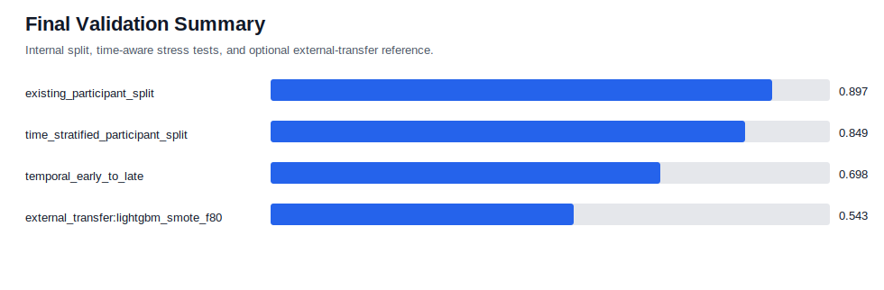
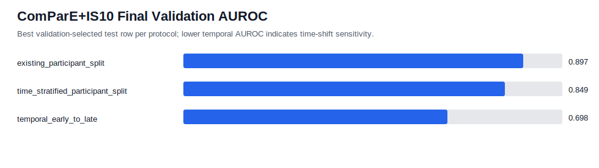
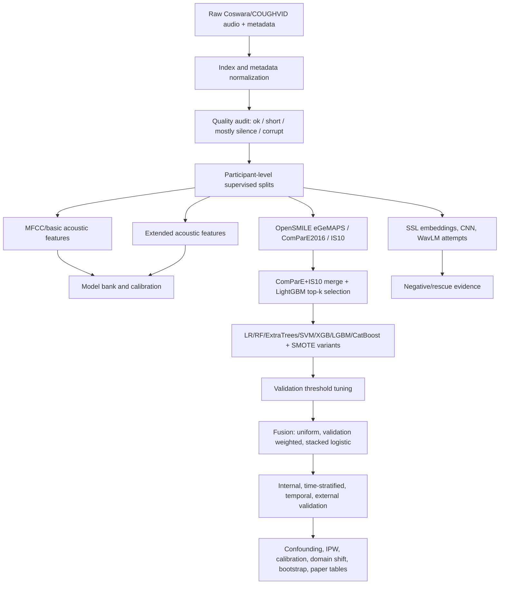

# Rebuilt End-to-End COVID Audio Research Dossier

Date: 2026-06-20

Repository state inspected: `publication-upgrade-confounding-da` at commit `8c481ec` plus final metric artifact bundle `covid_btp_final_doc_artifacts_small.tar.gz`.

Scope rule: this is a new dossier rebuilt from primary paper PDFs/text, current code, and generated metric artifacts. It is not based on the earlier dossier narrative.

## Executive Verdict

The project does **not** support a claim that we beat all published SOTA metrics. It does support a stronger and more defensible research claim: high internal COVID-audio metrics on Coswara are achievable, but they degrade under time-aware validation and collapse under true Coswara-to-COUGHVID external transfer. The final ComParE+IS10 pipeline reaches `AUROC 0.897` on the existing participant split, `0.849` on a time-stratified participant split, `0.698` on strict early-to-late temporal validation, and only `0.543` on COUGHVID external transfer.

The strongest contribution is therefore not a leaderboard claim. The contribution is an end-to-end reliability audit: stronger internal modeling, paper-style CV, temporal validation, month shortcut analysis, metadata confounding, IPW sensitivity, calibration, domain shift, and external COUGHVID transfer.

## Final Result Snapshot

### Final ComParE+IS10 Validation
| evaluation_protocol | model_name | modality | modality_combination | fusion_method | feature_strategy | selected_feature_k | auroc | auprc | balanced_accuracy | f1 | sensitivity | specificity | n_samples | delta_auroc_from_existing |
| --- | --- | --- | --- | --- | --- | --- | --- | --- | --- | --- | --- | --- | --- | --- |
| compare_is10_existing_participant_split | strong_baseline_selected_fusion | multimodal | cough+speech | stacked_logistic_validation | compare_is10_top800_lightgbm | 800.000 | 0.897 | 0.863 | 0.825 | 0.752 | 0.833 | 0.816 | 314.000 | 0.000 |
| compare_is10_time_stratified_participant_split | strong_baseline_selected_fusion | multimodal | cough+breath+speech | uniform_mean | compare_is10_top800_lightgbm | 800.000 | 0.849 | 0.783 | 0.783 | 0.705 | 0.710 | 0.857 | 431.000 | -0.048 |
| compare_is10_temporal_early_to_late | top_4_validation_ensemble | breath |  |  | compare_is10_top800_lightgbm | 800.000 | 0.698 | 0.896 | 0.656 | 0.751 | 0.646 | 0.667 | 411.000 | -0.199 |

### COUGHVID External Transfer
| model_name | modality | feature_strategy | selected_feature_k | auroc | auprc | balanced_accuracy | f1 | sensitivity | specificity | n_samples | n_participants |
| --- | --- | --- | --- | --- | --- | --- | --- | --- | --- | --- | --- |
| lightgbm_smote_f80 | cough | compare_is10_top800_lightgbm | 800.000 | 0.543 | 0.040 | 0.510 | 0.058 | 0.084 | 0.936 | 8331.000 | 8331.000 |
| xgboost_smote_f80 | cough | compare_is10_top800_lightgbm | 800.000 | 0.532 | 0.039 | 0.505 | 0.063 | 0.267 | 0.743 | 8331.000 | 8331.000 |
| catboost_smote_f80 | cough | compare_is10_top800_lightgbm | 800.000 | 0.531 | 0.040 | 0.506 | 0.059 | 0.144 | 0.869 | 8331.000 | 8331.000 |
| svc_rbf_f60 | cough | compare_is10_top800_lightgbm | 800.000 | 0.523 | 0.037 | 0.500 | 0.058 | 0.193 | 0.807 | 8331.000 | 8331.000 |

### Paper-Comparable 10-Fold CV
| model_name | modality | feature_strategy | selected_feature_k | auroc | auroc_std | auprc | auprc_std | balanced_accuracy | f1 | n_samples |
| --- | --- | --- | --- | --- | --- | --- | --- | --- | --- | --- |
| svc_rbf_f60 | cough | compare_is10_top800_lightgbm | 800.000 | 0.819 | 0.029 | 0.728 | 0.036 | 0.737 | 0.645 | 4094.000 |
| lightgbm_smote_f80 | cough | compare_is10_top800_lightgbm | 800.000 | 0.819 | 0.027 | 0.732 | 0.035 | 0.732 | 0.638 | 4094.000 |
| catboost_smote_f80 | cough | compare_is10_top800_lightgbm | 800.000 | 0.806 | 0.027 | 0.717 | 0.035 | 0.729 | 0.636 | 4094.000 |
| lightgbm_smote_f80 | speech | compare_is10_top800_lightgbm | 800.000 | 0.806 | 0.014 | 0.705 | 0.021 | 0.732 | 0.635 | 9983.000 |
| xgboost_smote_f80 | cough | compare_is10_top800_lightgbm | 800.000 | 0.803 | 0.026 | 0.715 | 0.031 | 0.721 | 0.623 | 4094.000 |
| svc_rbf_f60 | speech | compare_is10_top800_lightgbm | 800.000 | 0.803 | 0.014 | 0.697 | 0.021 | 0.725 | 0.626 | 9983.000 |
| catboost_smote_f80 | speech | compare_is10_top800_lightgbm | 800.000 | 0.793 | 0.011 | 0.684 | 0.019 | 0.723 | 0.624 | 9983.000 |
| xgboost_smote_f80 | speech | compare_is10_top800_lightgbm | 800.000 | 0.786 | 0.012 | 0.674 | 0.018 | 0.713 | 0.610 | 9983.000 |

## What The Research Actually Proves

- Coswara internal respiratory-audio classification can be made strong with reproducible feature engineering and model selection. The final internal participant-split AUROC is `0.897`.
- Internal performance is not sufficient evidence of deployable screening. The same final feature family drops to `0.698` under strict temporal early-to-late testing and to `0.543` under external COUGHVID transfer.
- Metadata alone predicts labels extremely well: full safe metadata AUROC `0.964`, symptoms-only AUROC `0.932`, demographic/protocol-only AUROC `0.914`. This limits causal claims about audio-only disease signal.
- The month audit shows collection period is a shortcut: removing recording month from full metadata improves strict temporal AUROC by `0.247`.
- Heavy and nature-inspired methods did not automatically solve the problem. Practical WavLM, PSO/swarm search, and gated stacking did not beat the final ComParE+IS10 pipeline.

## Research Goal And Evolution

The real research question became: can we satisfy the limitations and future-work directions of the COVID-audio literature using only Coswara and COUGHVID, without copying one paper and without pretending internal CV is deployment validation? The final answer is: we partially satisfy those directions by building a full validation and confounding framework, but we do not satisfy the SOTA leaderboard ambition.

### Decision Cycles
| cycle | decision | evidence | outcome |
| --- | --- | --- | --- |
| Initial publication closure baseline | Keep participant-level random split and basic MFCC/CNN/metadata pipeline as reference. | MFCC/logistic and RF reached around 0.75-0.80 AUROC; fusion around 0.88. | Useful baseline but not enough to address professor concern about low single-modality numbers or SOTA comparisons. |
| Temporal/causal upgrade | Add strict temporal holdout, time-stratified split, month label/covariate shift, and month ablation. | Temporal AUROC dropped from 0.873 to 0.566 in earlier stress test; month removal improved metadata temporal AUROC by 0.247. | Strong reliability story: collection month acts as shortcut. |
| Strong model-bank upgrade | Replace simple LR-only baseline with extended acoustic features and multiple learners with SMOTE/Optuna/fusion. | Strong internal AUROC reached about 0.891 but not >0.90 consistently. | Improved internal numbers but did not create SOTA-level evidence. |
| Deep SSL/WavLM attempt | Fine-tune WavLM-base-plus branches on segmented cough/breath/speech. | Cough and breath test AUROC stayed around 0.79 on practical run. | Stopped as unproductive for timeline; evidence that heavier model alone was not enough. |
| Swarm/gated stack attempt | Try PSO-style feature subset search and gated prediction stacking. | PSO validation objectives around 0.73-0.77; gated stack test around 0.891, not materially above strong baseline. | Not final headline; retained only as negative/rescue evidence. |
| ComParE+IS10 rescue | Extract standardized OpenSMILE ComParE2016 and IS10, merge with strong features, select top-k by LightGBM. | Final internal selected result reached AUROC 0.897; paper-style CV cough 0.819 and speech 0.806. | Best final internal pipeline; still below SOTA papers but cleaner and more reproducible. |
| Final validation option B | Run existing participant split, time-stratified split, strict temporal split, and COUGHVID external transfer on the final feature strategy. | 0.897 internal -> 0.849 time-stratified -> 0.698 temporal -> 0.543 COUGHVID external. | Final defensible research result: strong internal performance does not survive external transfer. |

## Datasets And Label Reality

### Coswara Supervised/Unknown Label Counts
| dataset | modality | label_binary | n_recordings | n_participants |
| --- | --- | --- | --- | --- |
| coswara | breath | negative | 2866 | 1433 |
| coswara | breath | positive | 1362 | 681 |
| coswara | breath | unknown | 1264 | 632 |
| coswara | cough | negative | 2865 | 1433 |
| coswara | cough | positive | 1362 | 681 |
| coswara | cough | unknown | 1264 | 632 |
| coswara | speech | negative | 7164 | 1433 |
| coswara | speech | positive | 3405 | 681 |
| coswara | speech | unknown | 3160 | 632 |

### Audio Quality Audit
| quality_flag | n_recordings | median_duration_sec | median_silence_ratio | median_clipping_ratio |
| --- | --- | --- | --- | --- |
| ok | 23539 | 8.789 | 0.106 | 0.000 |
| mostly_silence | 597 | 7.680 | 0.802 | 0.000 |
| corrupt | 390 | 0.000 | 1.000 | 0.000 |
| short | 186 | 0.597 | 0.000 | 0.000 |

Unknown labels are kept for audit accounting but excluded from supervised positive/negative model training and testing. This is why validation can warn about unknown labels while the supervised metric rows are still valid.

### Monthly Label Shift
Monthly prevalence is highly nonstationary. It starts near zero in 2020-04 and reaches `0.915` in 2022-01, which makes recording month a plausible label shortcut.
| recording_year_month | n_participants | n_positive | n_negative | positive_prevalence | symptom_count_mean | quality_ok_share | female_share | top_country |
| --- | --- | --- | --- | --- | --- | --- | --- | --- |
| 2020-04 | 647 | 1 | 646 | 0.002 | 0.012 | 0.981 | 0.227 | India |
| 2020-05 | 284 | 2 | 282 | 0.007 | 0.137 | 0.982 | 0.254 | India |
| 2020-06 | 34 | 2 | 32 | 0.059 | 0.206 | 1.000 | 0.176 | India |
| 2020-07 | 48 | 2 | 46 | 0.042 | 0.375 | 0.958 | 0.167 | India |
| 2020-08 | 138 | 36 | 102 | 0.261 | 0.601 | 0.942 | 0.239 | India |
| 2020-09 | 64 | 44 | 20 | 0.688 | 1.328 | 0.938 | 0.375 | India |
| 2020-10 | 41 | 11 | 30 | 0.268 | 1.000 | 1.000 | 0.366 | India |
| 2020-11 | 11 | 2 | 9 | 0.182 | 0.455 | 1.000 | 0.273 | India |
| 2020-12 | 29 | 8 | 21 | 0.276 | 0.828 | 1.000 | 0.241 | India |
| 2021-01 | 9 | 0 | 9 | 0.000 | 0.111 | 1.000 | 0.111 | India |
| 2021-02 | 15 | 3 | 12 | 0.200 | 0.933 | 1.000 | 0.267 | India |
| 2021-03 | 15 | 4 | 11 | 0.267 | 1.400 | 1.000 | 0.467 | India |
| 2021-04 | 89 | 28 | 61 | 0.315 | 0.843 | 1.000 | 0.315 | India |
| 2021-05 | 53 | 36 | 17 | 0.679 | 1.774 | 1.000 | 0.302 | India |
| 2021-06 | 110 | 71 | 39 | 0.645 | 1.700 | 0.991 | 0.345 | India |
| 2021-07 | 103 | 90 | 13 | 0.874 | 2.835 | 1.000 | 0.398 | India |
| 2021-08 | 19 | 5 | 14 | 0.263 | 0.947 | 1.000 | 0.526 | India |
| 2021-09 | 100 | 85 | 15 | 0.850 | 3.350 | 0.990 | 0.580 | India |
| 2021-10 | 4 | 1 | 3 | 0.250 | 1.250 | 1.000 | 0.250 | India |
| 2021-11 | 6 | 0 | 6 | 0.000 | 0.333 | 0.833 | 0.500 | India |
| 2021-12 | 8 | 1 | 7 | 0.125 | 0.750 | 1.000 | 0.000 | India |
| 2022-01 | 189 | 173 | 16 | 0.915 | 3.011 | 0.958 | 0.407 | India |
| 2022-02 | 98 | 76 | 22 | 0.776 | 2.755 | 0.980 | 0.327 | India |

## End-to-End Pipeline

### Main Implementation Files
- `src/covid_audio_btp/metrics.py`: AUROC, AUPRC, balanced accuracy, F1, sensitivity, specificity, Brier, ECE, NLL, and validation threshold selection.
- `src/covid_audio_btp/strong_features.py`: extended acoustic feature extraction and deterministic training-only waveform augmentation.
- `src/covid_audio_btp/opensmile_features.py`: eGeMAPSv02, ComParE2016, and IS10 extraction with resumable chunked CSV writing.
- `src/covid_audio_btp/compare_is10_rescue.py`: feature-bank merge, train-only ranking, and top-k selected feature tables.
- `src/covid_audio_btp/strong_baseline.py`: model bank, SMOTE pipelines, Optuna search, modality ensembles, fusion, and stacking.
- `src/covid_audio_btp/paper_comparable_cv.py`: recording-level 10-fold paper-comparable CV with fold-local feature selection.
- `src/covid_audio_btp/compare_is10_final_validation.py`: existing split, time-stratified split, temporal split, and COUGHVID external transfer.
- `src/covid_audio_btp/metadata_confounding.py`: symptoms/demographic/protocol/full-safe metadata confounding audit.
- `src/covid_audio_btp/temporal_month_causal.py`: month prevalence/covariate shift, matched temporal cohort, uncertainty, and month ablation.
- `src/covid_audio_btp/domain_adaptation.py`: RBF-MMD and CORAL source-to-target alignment baseline.

## Methods And Formulas

### Feature Families
The final strongest feature strategy is `compare_is10_top800_lightgbm`. It combines the project acoustic feature bank with OpenSMILE ComParE2016 and IS10, then selects the top 800 features using LightGBM importance fitted on training data only. The extended acoustic bank includes duration, waveform absolute mean/max, MFCCs, delta MFCCs, delta-delta MFCCs, mel-band summaries, chroma, spectral contrast, tonnetz, RMS, zero-crossing rate, spectral centroid, bandwidth, rolloff, flatness, and tempogram statistics. Time-varying features are summarized with mean, standard deviation, min, max, median, quartiles, IQR, skewness, and kurtosis.

### Metrics
- Sensitivity/recall/TPR = `TP / (TP + FN)`.
- Specificity/TNR = `TN / (TN + FP)`.
- Balanced accuracy = `(sensitivity + specificity) / 2`.
- Precision = `TP / (TP + FP)`.
- F1 = `2 * precision * recall / (precision + recall)`.
- Brier score = `(1/n) * sum_i (p_i - y_i)^2`.
- Negative log likelihood = `-(1/n) * sum_i [y_i log(p_i) + (1-y_i) log(1-p_i)]`, with probability clipping.
- ECE = `sum_b (|B_b|/n) * |mean(y in B_b) - mean(p in B_b)|` over 10 probability bins.
- Validation threshold selection sweeps unique validation probabilities and midpoints, choosing the threshold that maximizes validation balanced accuracy.
- Uniform fusion = `(1/K) * sum_k p_k`. Validation-weighted fusion = `sum_k w_k p_k / sum_k w_k`. Stacked fusion fits a logistic meta-model over validation predictions.
- IPW uses inverse label-propensity weights to downweight overrepresented metadata configurations; residual imbalance is reported as standardized mean differences.
- RBF-MMD measures source/target feature-distribution discrepancy. CORAL whitens source covariance and recolors it toward target covariance.

## Results By Experiment Family

### Baseline MFCC/ML
| model_name | modality | auroc | auprc | balanced_accuracy | f1 | sensitivity | specificity | n_samples |
| --- | --- | --- | --- | --- | --- | --- | --- | --- |
| random_forest | cough | 0.804 | 0.717 | 0.657 | 0.493 | 0.354 | 0.960 | 636.000 |
| random_forest | breath | 0.797 | 0.675 | 0.678 | 0.543 | 0.432 | 0.923 | 636.000 |
| logistic_regression | cough | 0.796 | 0.672 | 0.739 | 0.648 | 0.772 | 0.707 | 636.000 |
| logistic_regression | breath | 0.762 | 0.576 | 0.690 | 0.595 | 0.752 | 0.628 | 636.000 |
| random_forest | speech | 0.756 | 0.617 | 0.643 | 0.473 | 0.353 | 0.933 | 1590.000 |
| logistic_regression | speech | 0.748 | 0.602 | 0.674 | 0.578 | 0.736 | 0.612 | 1590.000 |
| dummy_stratified | speech | 0.515 | 0.331 | 0.515 | 0.343 | 0.342 | 0.687 | 1590.000 |
| dummy_most_frequent | cough | 0.500 | 0.324 | 0.500 | 0.000 | 0.000 | 1.000 | 636.000 |
| dummy_most_frequent | breath | 0.500 | 0.324 | 0.500 | 0.000 | 0.000 | 1.000 | 636.000 |
| dummy_most_frequent | speech | 0.500 | 0.324 | 0.500 | 0.000 | 0.000 | 1.000 | 1590.000 |
| dummy_stratified | cough | 0.479 | 0.316 | 0.479 | 0.296 | 0.296 | 0.663 | 636.000 |
| dummy_stratified | breath | 0.479 | 0.316 | 0.479 | 0.296 | 0.296 | 0.663 | 636.000 |

### Strong Acoustic Model Bank
| evaluation_protocol | analysis_family | model_name | modality | modality_combination | fusion_method | auroc | auprc | balanced_accuracy | f1 | n_participants |
| --- | --- | --- | --- | --- | --- | --- | --- | --- | --- | --- |
| clean_internal_protocol | strong_multimodal_fusion | strong_baseline_selected_fusion | multimodal | cough+breath+speech | validation_weighted_auprc | 0.891 | 0.846 | 0.836 | 0.784 | 312.000 |
| clean_internal_protocol | strong_multimodal_fusion | strong_baseline_selected_fusion | multimodal | cough+breath+speech | stacked_logistic_validation | 0.891 | 0.842 | 0.781 | 0.695 | 312.000 |
| clean_internal_protocol | strong_global_stacking | top_10_global_stack | multimodal | global_prediction_stack | top_global_validation_weighted_auroc | 0.890 | 0.839 | 0.809 | 0.731 | 312.000 |
| clean_internal_protocol | strong_multimodal_fusion | strong_baseline_selected_fusion | multimodal | cough+breath+speech | uniform_mean | 0.890 | 0.845 | 0.836 | 0.784 | 312.000 |
| clean_internal_protocol | strong_global_stacking | top_10_global_stack | multimodal | global_prediction_stack | top_global_uniform_mean | 0.890 | 0.839 | 0.809 | 0.731 | 312.000 |
| clean_internal_protocol | strong_global_stacking | top_10_global_stack | multimodal | global_prediction_stack | top_global_stacked_logistic_validation | 0.890 | 0.839 | 0.805 | 0.723 | 312.000 |
| clean_internal_protocol | strong_multimodal_fusion | strong_baseline_selected_fusion | multimodal | cough+speech | validation_weighted_auprc | 0.888 | 0.841 | 0.816 | 0.736 | 314.000 |
| clean_internal_protocol | strong_multimodal_fusion | strong_baseline_selected_fusion | multimodal | cough+speech | uniform_mean | 0.888 | 0.840 | 0.807 | 0.738 | 314.000 |
| clean_internal_protocol | strong_multimodal_fusion | strong_baseline_selected_fusion | multimodal | cough+speech | stacked_logistic_validation | 0.888 | 0.838 | 0.815 | 0.739 | 314.000 |
| clean_internal_protocol | strong_multimodal_fusion | strong_baseline_selected_fusion | multimodal | breath+speech | stacked_logistic_validation | 0.884 | 0.826 | 0.804 | 0.726 | 312.000 |
| clean_internal_protocol | strong_multimodal_fusion | strong_baseline_selected_fusion | multimodal | breath+speech | validation_weighted_auprc | 0.882 | 0.823 | 0.797 | 0.715 | 312.000 |
| clean_internal_protocol | strong_multimodal_fusion | strong_baseline_selected_fusion | multimodal | breath+speech | uniform_mean | 0.881 | 0.819 | 0.781 | 0.694 | 312.000 |

### CNN / Spectrogram Branches
| source_file | model_name | architecture | modality | auroc | auprc | balanced_accuracy | f1 | sensitivity | specificity | n_samples |
| --- | --- | --- | --- | --- | --- | --- | --- | --- | --- | --- |
| cnn_metrics.csv | compact_cnn |  | cough | 0.750 | 0.559 | 0.669 | 0.578 | 0.786 | 0.551 | 636.000 |
| cnn_metrics_10epoch_cough.csv | compact_cnn |  | cough | 0.749 | 0.551 | 0.686 | 0.595 | 0.825 | 0.547 | 636.000 |
| cnn_metrics_cnn_bigru_cough.csv | cnn_bigru | cnn_bigru | cough | 0.730 | 0.556 | 0.686 | 0.586 | 0.680 | 0.693 | 636.000 |
| cnn_metrics_cnn_bigru_breath.csv | cnn_bigru | cnn_bigru | breath | 0.710 | 0.590 | 0.649 | 0.550 | 0.684 | 0.614 | 636.000 |
| cnn_metrics_cnn_bigru_speech.csv | cnn_bigru | cnn_bigru | speech | 0.676 | 0.490 | 0.638 | 0.524 | 0.579 | 0.698 | 1590.000 |
| cnn_metrics_residual_cnn_breath.csv | residual_cnn | residual_cnn | breath | 0.676 | 0.548 | 0.627 | 0.500 | 0.515 | 0.740 | 636.000 |
| cnn_metrics_residual_cnn_cough.csv | residual_cnn | residual_cnn | cough | 0.650 | 0.445 | 0.607 | 0.479 | 0.510 | 0.705 | 636.000 |
| cnn_metrics_residual_cnn_speech.csv | residual_cnn | residual_cnn | speech | 0.634 | 0.440 | 0.609 | 0.488 | 0.540 | 0.677 | 1590.000 |
| cnn_metrics_smoke_cough.csv | compact_cnn |  | cough | 0.611 | 0.445 | 0.536 | 0.504 | 0.961 | 0.112 | 636.000 |

### WavLM Fine-Tuning Attempt
| model_name | modality | submodality | metric_split | auroc | auprc | balanced_accuracy | f1 | sensitivity | specificity | n_samples |
| --- | --- | --- | --- | --- | --- | --- | --- | --- | --- | --- |
| microsoft/wavlm-base-plus | breath | shallow_breath | test | 0.790 | 0.654 | 0.731 | 0.627 | 0.804 | 0.657 | 296.000 |
| microsoft/wavlm-base-plus | cough | shallow_cough | test | 0.790 | 0.731 | 0.713 | 0.614 | 0.608 | 0.817 | 310.000 |
| microsoft/wavlm-base-plus | cough | heavy_cough | test | 0.789 | 0.696 | 0.730 | 0.636 | 0.673 | 0.787 | 312.000 |
| microsoft/wavlm-base-plus | breath | deep_breath | test | 0.782 | 0.674 | 0.714 | 0.602 | 0.582 | 0.845 | 298.000 |

### Swarm And Gated Stack Attempts
| evaluation_protocol | analysis_family | model_name | modality | auroc | auprc | balanced_accuracy | f1 | n_participants |
| --- | --- | --- | --- | --- | --- | --- | --- | --- |
| sota_swarm_internal_protocol | sota_swarm_feature_search | binary_pso_lightgbm | cough | 0.820 | 0.743 | 0.744 | 0.653 | 318.000 |
| sota_swarm_internal_protocol | sota_swarm_feature_search | binary_pso_lightgbm | speech | 0.816 | 0.686 | 0.755 | 0.667 | 318.000 |
| sota_swarm_internal_protocol | sota_swarm_feature_search | binary_pso_lightgbm | breath | 0.811 | 0.731 | 0.720 | 0.621 | 318.000 |

| evaluation_protocol | analysis_family | model_name | fusion_method | metric_split | auroc | auprc | balanced_accuracy | f1 | n_ensemble_models | n_participants |
| --- | --- | --- | --- | --- | --- | --- | --- | --- | --- | --- |
| sota_gated_internal_protocol | sota_gated_prediction_stack | validation_gated_stack | gated_stacked_logistic_validation | test | 0.891 | 0.842 | 0.830 | 0.764 | 16.000 | 312.000 |
| sota_gated_internal_protocol | sota_gated_prediction_stack | validation_gated_stack | gated_uniform_mean | test | 0.891 | 0.842 | 0.828 | 0.761 | 16.000 | 312.000 |
| sota_gated_internal_protocol | sota_gated_prediction_stack | validation_gated_stack | gated_validation_weighted_auroc | test | 0.891 | 0.842 | 0.828 | 0.761 | 16.000 | 312.000 |

### ComParE+IS10 Rescue
| evaluation_protocol | analysis_family | model_name | modality | modality_combination | fusion_method | feature_strategy | selected_feature_k | auroc | auprc | balanced_accuracy | f1 | n_participants |
| --- | --- | --- | --- | --- | --- | --- | --- | --- | --- | --- | --- | --- |
| clean_internal_protocol | strong_multimodal_fusion | strong_baseline_selected_fusion | multimodal | cough+speech | stacked_logistic_validation | compare_is10_top800_lightgbm | 800.000 | 0.898 | 0.856 | 0.829 | 0.763 | 314.000 |
| clean_internal_protocol | strong_multimodal_fusion | strong_baseline_selected_fusion | multimodal | cough+speech | validation_weighted_auprc | compare_is10_top800_lightgbm | 800.000 | 0.897 | 0.858 | 0.824 | 0.756 | 314.000 |
| clean_internal_protocol | strong_global_stacking | top_10_global_stack | multimodal | global_prediction_stack | top_global_stacked_logistic_validation | compare_is10_top800_lightgbm | 800.000 | 0.897 | 0.850 | 0.823 | 0.752 | 312.000 |
| clean_internal_protocol | strong_multimodal_fusion | strong_baseline_selected_fusion | multimodal | cough+speech | uniform_mean | compare_is10_top800_lightgbm | 800.000 | 0.897 | 0.858 | 0.822 | 0.751 | 314.000 |
| clean_internal_protocol | strong_global_stacking | top_10_global_stack | multimodal | global_prediction_stack | top_global_uniform_mean | compare_is10_top800_lightgbm | 800.000 | 0.897 | 0.849 | 0.825 | 0.756 | 312.000 |
| clean_internal_protocol | strong_global_stacking | top_10_global_stack | multimodal | global_prediction_stack | top_global_validation_weighted_auroc | compare_is10_top800_lightgbm | 800.000 | 0.897 | 0.849 | 0.825 | 0.756 | 312.000 |
| clean_internal_protocol | strong_multimodal_fusion | strong_baseline_selected_fusion | multimodal | cough+breath+speech | stacked_logistic_validation | compare_is10_top800_lightgbm | 800.000 | 0.895 | 0.849 | 0.802 | 0.721 | 312.000 |
| clean_internal_protocol | strong_global_stacking | top_10_global_stack | multimodal | global_prediction_stack | top_global_validation_weighted_auroc | compare_is10_top500_lightgbm | 500.000 | 0.893 | 0.844 | 0.826 | 0.755 | 312.000 |
| clean_internal_protocol | strong_global_stacking | top_10_global_stack | multimodal | global_prediction_stack | top_global_stacked_logistic_validation | compare_is10_top500_lightgbm | 500.000 | 0.893 | 0.843 | 0.828 | 0.758 | 312.000 |
| clean_internal_protocol | strong_global_stacking | top_10_global_stack | multimodal | global_prediction_stack | top_global_uniform_mean | compare_is10_top500_lightgbm | 500.000 | 0.893 | 0.843 | 0.826 | 0.755 | 312.000 |
| clean_internal_protocol | strong_feature_level_fusion | lightgbm_smote_f80 | multimodal | cough+breath+speech |  | compare_is10_top1200_lightgbm | 1200.000 | 0.893 | 0.844 | 0.817 | 0.750 | 312.000 |
| clean_internal_protocol | strong_multimodal_fusion | strong_baseline_selected_fusion | multimodal | cough+breath+speech | stacked_logistic_validation | compare_is10_top500_lightgbm | 500.000 | 0.892 | 0.843 | 0.832 | 0.768 | 312.000 |
| clean_internal_protocol | strong_multimodal_fusion | strong_baseline_selected_fusion | multimodal | cough+breath+speech | validation_weighted_auprc | compare_is10_top800_lightgbm | 800.000 | 0.892 | 0.847 | 0.802 | 0.722 | 312.000 |
| clean_internal_protocol | strong_multimodal_fusion | strong_baseline_selected_fusion | multimodal | cough+speech | stacked_logistic_validation | compare_is10_top500_lightgbm | 500.000 | 0.891 | 0.845 | 0.841 | 0.778 | 314.000 |
| clean_internal_protocol | strong_multimodal_fusion | strong_baseline_selected_fusion | multimodal | cough+speech | validation_weighted_auprc | compare_is10_top500_lightgbm | 500.000 | 0.891 | 0.844 | 0.839 | 0.774 | 314.000 |

## Confounding And Shortcut Analyses

### Metadata-Only Label Predictability
| audit_model | model_name | auroc | auprc | balanced_accuracy | f1 | sensitivity | specificity | brier | ece | nll | n_samples |
| --- | --- | --- | --- | --- | --- | --- | --- | --- | --- | --- | --- |
| full_safe_metadata | metadata_confounding_logistic_regression | 0.964 | 0.928 | 0.890 | 0.849 | 0.858 | 0.922 | 0.077 | 0.064 | 0.257 | 2862.000 |
| symptoms_only | metadata_confounding_logistic_regression | 0.932 | 0.898 | 0.912 | 0.876 | 0.893 | 0.930 | 0.075 | 0.096 | 0.281 | 2862.000 |
| demographic_protocol_only | metadata_confounding_logistic_regression | 0.914 | 0.737 | 0.827 | 0.751 | 0.864 | 0.790 | 0.122 | 0.117 | 0.423 | 2862.000 |

### Metadata Feature Group Attribution
| audit_model | feature_group | n_features | importance_share | top_feature | top_coefficient | top_importance_abs |
| --- | --- | --- | --- | --- | --- | --- |
| demographic_protocol_only | demographic | 37 | 0.591 | country_India | 0.635 | 0.635 |
| demographic_protocol_only | recording_protocol | 8 | 0.409 | recording_year | 2.648 | 2.648 |
| full_safe_metadata | demographic | 37 | 0.380 | country_India | 0.591 | 0.591 |
| full_safe_metadata | recording_protocol | 8 | 0.254 | recording_year | 2.001 | 2.001 |
| full_safe_metadata | symptom_or_label_proxy | 10 | 0.229 | symptoms_json_cough | 0.661 | 0.661 |
| full_safe_metadata | comorbidity_proxy | 8 | 0.137 | comorbidities_json_others_preexist | 0.687 | 0.687 |
| symptoms_only | symptom_or_label_proxy | 10 | 1.000 | symptoms_json_cough | 0.873 | 0.873 |

### IPW Sensitivity
| control_method | auroc | auprc | balanced_accuracy | f1 | sensitivity | specificity | brier | ece | nll | n_samples |
| --- | --- | --- | --- | --- | --- | --- | --- | --- | --- | --- |
| unweighted | 0.879 | 0.832 | 0.804 | 0.731 | 0.767 | 0.842 | 0.190 | 0.150 | 0.564 | 318.000 |
| ipw_label_propensity | 0.807 | 0.624 | 0.742 | 0.541 | 0.679 | 0.804 | 0.156 | 0.190 | 0.495 | 318.000 |
| ipw_label_propensity | 0.807 | 0.624 | 0.742 | 0.541 | 0.679 | 0.804 | 0.156 | 0.190 | 0.495 | 318.000 |
| ipw_label_propensity | 0.807 | 0.624 | 0.742 | 0.541 | 0.679 | 0.804 | 0.156 | 0.190 | 0.495 | 318.000 |
| ipw_label_propensity | 0.793 | 0.573 | 0.731 | 0.489 | 0.679 | 0.782 | 0.150 | 0.203 | 0.483 | 318.000 |
| ipw_label_propensity | 0.793 | 0.573 | 0.731 | 0.489 | 0.679 | 0.782 | 0.150 | 0.203 | 0.483 | 318.000 |
| ipw_label_propensity | 0.793 | 0.573 | 0.731 | 0.489 | 0.679 | 0.782 | 0.150 | 0.203 | 0.483 | 318.000 |
| ipw_label_propensity | 0.787 | 0.555 | 0.726 | 0.470 | 0.679 | 0.773 | 0.149 | 0.207 | 0.480 | 318.000 |
| ipw_label_propensity | 0.787 | 0.555 | 0.726 | 0.470 | 0.679 | 0.773 | 0.149 | 0.207 | 0.480 | 318.000 |
| ipw_label_propensity | 0.780 | 0.537 | 0.721 | 0.450 | 0.679 | 0.763 | 0.147 | 0.210 | 0.478 | 318.000 |
| ipw_label_propensity | 0.780 | 0.537 | 0.721 | 0.450 | 0.679 | 0.763 | 0.147 | 0.210 | 0.478 | 318.000 |
| ipw_label_propensity | 0.779 | 0.533 | 0.719 | 0.440 | 0.679 | 0.760 | 0.146 | 0.213 | 0.475 | 318.000 |

### Residual SMD After IPW
| feature | before_abs_smd | after_abs_smd | smd_reduction | balance_severity | rank_after_weighting |
| --- | --- | --- | --- | --- | --- |
| recording_year | 1.384 | 0.724 | 0.660 | severe_residual_imbalance | 1 |
| country_India | 0.525 | 0.438 | 0.086 | moderate_residual_imbalance | 2 |
| country_United States | 0.296 | 0.250 | 0.045 | moderate_residual_imbalance | 3 |
| gender_female | 0.421 | 0.236 | 0.185 | minor_residual_imbalance | 4 |
| recording_month | 0.244 | 0.235 | 0.009 | minor_residual_imbalance | 5 |
| gender_male | 0.410 | 0.228 | 0.181 | minor_residual_imbalance | 6 |
| age | 0.386 | 0.225 | 0.161 | minor_residual_imbalance | 7 |
| quality_flag_mostly_silence | 0.373 | 0.222 | 0.151 | minor_residual_imbalance | 8 |
| duration_sec | 0.368 | 0.200 | 0.169 | minor_residual_imbalance | 9 |
| quality_flag_ok | 0.316 | 0.167 | 0.149 | minor_residual_imbalance | 10 |
| sample_rate_original_44100.0 | 0.327 | 0.125 | 0.202 | minor_residual_imbalance | 11 |
| sample_rate_original_16000.0 | 0.140 | 0.117 | 0.023 | minor_residual_imbalance | 12 |
| sample_rate_original_48000.0 | 0.294 | 0.117 | 0.177 | minor_residual_imbalance | 13 |
| country_Canada | 0.137 | 0.116 | 0.021 | minor_residual_imbalance | 14 |
| sample_rate_original_unknown | 0.137 | 0.116 | 0.021 | minor_residual_imbalance | 15 |
| country_Pakistan | 0.097 | 0.083 | 0.014 | well_balanced | 16 |
| country_France | 0.097 | 0.082 | 0.014 | well_balanced | 17 |
| gender_other | 0.097 | 0.082 | 0.014 | well_balanced | 18 |
| country_Hungary | 0.097 | 0.082 | 0.014 | well_balanced | 19 |
| country_Mexico | 0.097 | 0.082 | 0.014 | well_balanced | 20 |

## Temporal And Domain Shift

### Earlier Temporal Stress Test
| evaluation_protocol | analysis_family | model_name | modality | auroc | auprc | brier | ece | n_samples |
| --- | --- | --- | --- | --- | --- | --- | --- | --- |
| existing_participant_split | multimodal_fusion | logistic_regression | multimodal | 0.873 | 0.807 | 0.170 | 0.195 | 318.000 |
| time_stratified_participant_split | multimodal_fusion | logistic_regression | multimodal | 0.787 | 0.670 | 0.183 | 0.129 | 444.000 |
| temporal_early_to_late | multimodal_fusion | logistic_regression | multimodal | 0.566 | 0.822 | 0.330 | 0.396 | 424.000 |
| coswara_to_coughvid_external | external_transfer | external_transfer_beats_best | cough | 0.553 | 0.039 |  |  | 8331.000 |

| comparison | reference_protocol | stress_protocol | reference_auroc | stress_auroc | delta_auroc | delta_ci_low | delta_ci_high | p_value_two_sided | n_bootstraps |
| --- | --- | --- | --- | --- | --- | --- | --- | --- | --- |
| temporal_minus_participant_full_multimodal | existing_participant_split | temporal_early_to_late | 0.873 | 0.566 | -0.308 | -0.391 | -0.221 | 0.000 | 5000 |

### Matched Temporal Cohort
| evaluation_protocol | analysis_family | model_name | modality | auroc | auprc | balanced_accuracy | f1 | sensitivity | specificity | brier | ece | nll | n_samples |
| --- | --- | --- | --- | --- | --- | --- | --- | --- | --- | --- | --- | --- | --- |
| matched_temporal_train_test | matched_audio_modality | logistic_regression | cough | 0.501 | 0.811 | 0.506 | 0.675 | 0.579 | 0.434 | 0.516 | 0.516 | 2.928 | 848.000 |
| matched_temporal_train_test | matched_audio_modality | logistic_regression | breath | 0.579 | 0.846 | 0.563 | 0.764 | 0.705 | 0.422 | 0.427 | 0.433 | 1.921 | 848.000 |
| matched_temporal_train_test | matched_audio_modality | logistic_regression | speech | 0.536 | 0.820 | 0.520 | 0.664 | 0.560 | 0.480 | 0.409 | 0.436 | 1.317 | 2120.000 |
| matched_temporal_train_test | matched_multimodal_fusion | logistic_regression | multimodal | 0.583 | 0.833 | 0.549 | 0.408 | 0.267 | 0.831 | 0.356 | 0.428 | 0.956 | 424.000 |

### Uncertainty Under Shift
| evaluation_protocol | n_samples | mean_probability | mean_confidence | high_confidence_share | error_rate | high_confidence_error_rate |
| --- | --- | --- | --- | --- | --- | --- |
| existing_participant_split | 318 | 0.472 | 0.651 | 0.082 | 0.214 | 0.038 |
| temporal_early_to_late | 424 | 0.413 | 0.661 | 0.118 | 0.472 | 0.660 |
| time_stratified_participant_split | 444 | 0.442 | 0.669 | 0.113 | 0.284 | 0.080 |

### Month Ablation
| comparison | reference | comparison_configuration | reference_auroc | comparison_auroc | delta_auroc | interpretation |
| --- | --- | --- | --- | --- | --- | --- |
| Remove year minus full metadata | Full metadata | Remove year | 0.531 | 0.531 | 0.000 | no_improvement |
| Remove month minus full metadata | Full metadata | Remove month | 0.531 | 0.779 | 0.247 | improves_temporal_generalization |
| Remove year + month minus full metadata | Full metadata | Remove year + month | 0.531 | 0.779 | 0.247 | improves_temporal_generalization |

### Domain Discriminability
| representation | modality | audit_model | domain_auroc | domain_auprc | balanced_accuracy | f1 | n_samples | n_source | n_external | n_features |
| --- | --- | --- | --- | --- | --- | --- | --- | --- | --- | --- |
| mfcc | cough | domain_logistic_regression | 0.948 | 0.966 | 0.884 | 0.910 | 3768.000 | 4227 | 8331 | 252 |
| opensmile_egemaps | cough | domain_logistic_regression | 0.920 | 0.948 | 0.845 | 0.879 | 3728.000 | 4094 | 8331 | 92 |
| beats | cough | domain_logistic_regression | 0.966 | 0.981 | 0.904 | 0.929 | 3728.000 | 4094 | 8331 | 772 |
| panns | cough | domain_logistic_regression | 0.888 | 0.922 | 0.819 | 0.865 | 3728.000 | 4094 | 8331 | 1580 |

### MMD/CORAL Domain Adaptation Baseline
| representation | model_name | feature_strategy | n_features | source_rows | external_rows | mmd_before | mmd_after_coral | mmd_reduction_coral |
| --- | --- | --- | --- | --- | --- | --- | --- | --- |
| mfcc | logistic_regression | all | 252 | 2957 | 8331 | 0.008 | 0.005 | 0.003 |
| mfcc | logistic_regression | drop_high_shift | 232 | 2957 | 8331 | 0.008 | 0.005 | 0.003 |
| opensmile_egemaps | logistic_regression | all | 92 | 2861 | 8331 | 0.005 | 0.025 | -0.020 |
| opensmile_egemaps | logistic_regression | drop_high_shift | 90 | 2861 | 8331 | 0.005 | 0.025 | -0.020 |
| beats | logistic_regression | all | 772 | 2861 | 8331 | 0.055 | 0.004 | 0.051 |
| beats | logistic_regression | drop_high_shift | 742 | 2861 | 8331 | 0.036 | 0.005 | 0.031 |
| panns | logistic_regression | all | 1452 | 2861 | 8331 | 0.033 | 0.002 | 0.031 |
| panns | logistic_regression | drop_high_shift | 1450 | 2861 | 8331 | 0.022 | 0.003 | 0.020 |

| model_name | modality | feature_strategy | adaptation_method | representation | auroc | auprc | balanced_accuracy | f1 | sensitivity | specificity | brier | ece | nll | n_samples | calibration_method |
| --- | --- | --- | --- | --- | --- | --- | --- | --- | --- | --- | --- | --- | --- | --- | --- |
| logistic_regression | cough | drop_high_shift | source_only | beats | 0.553 | 0.039 | 0.515 | 0.067 | 0.186 | 0.845 | 0.091 | 0.201 | 0.331 | 8331 | platt |
| logistic_regression | cough | drop_high_shift | source_only | opensmile_egemaps | 0.552 | 0.039 | 0.517 | 0.068 | 0.211 | 0.823 | 0.080 | 0.180 | 0.303 | 8331 | platt |
| logistic_regression | cough | drop_high_shift | coral | opensmile_egemaps | 0.551 | 0.040 | 0.529 | 0.072 | 0.495 | 0.564 | 0.141 | 0.290 | 0.449 | 8331 | platt |
| logistic_regression | cough | all | coral | opensmile_egemaps | 0.550 | 0.040 | 0.536 | 0.073 | 0.530 | 0.542 | 0.142 | 0.287 | 0.448 | 8331 | platt |
| logistic_regression | cough | drop_high_shift | coral | beats | 0.550 | 0.041 | 0.515 | 0.067 | 0.330 | 0.700 | 0.143 | 0.284 | 0.449 | 8331 | platt |
| logistic_regression | cough | all | coral | beats | 0.549 | 0.040 | 0.519 | 0.069 | 0.340 | 0.697 | 0.141 | 0.284 | 0.445 | 8331 | platt |
| logistic_regression | cough | all | source_only | opensmile_egemaps | 0.547 | 0.039 | 0.525 | 0.074 | 0.182 | 0.867 | 0.070 | 0.158 | 0.277 | 8331 | platt |
| logistic_regression | cough | all | source_only | beats | 0.542 | 0.038 | 0.508 | 0.061 | 0.161 | 0.854 | 0.090 | 0.200 | 0.328 | 8331 | platt |
| logistic_regression | cough | all | coral | mfcc | 0.539 | 0.042 | 0.522 | 0.069 | 0.614 | 0.429 | 0.133 | 0.286 | 0.434 | 8331 | platt |
| logistic_regression | cough | all | source_only | mfcc | 0.510 | 0.038 | 0.509 | 0.065 | 0.323 | 0.696 | 0.085 | 0.202 | 0.322 | 8331 | platt |
| logistic_regression | cough | drop_high_shift | source_only | panns | 0.502 | 0.035 | 0.493 | 0.056 | 0.214 | 0.771 | 0.115 | 0.271 | 0.404 | 8331 | platt |
| logistic_regression | cough | all | coral | panns | 0.500 | 0.036 | 0.503 | 0.064 | 0.418 | 0.589 | 0.128 | 0.290 | 0.431 | 8331 | platt |

## External COUGHVID Context

Internal COUGHVID baselines are substantially stronger than Coswara-to-COUGHVID transfer. That means the external failure is not simply because COUGHVID is impossible; it is a transfer/domain/label mismatch problem.

| representation | model_name | modality | feature_strategy | auroc | auprc | balanced_accuracy | f1 | sensitivity | specificity | brier | ece | nll | n_samples | calibration_method |
| --- | --- | --- | --- | --- | --- | --- | --- | --- | --- | --- | --- | --- | --- | --- |
| MFCC | lightgbm | cough | all | 0.781 | 0.178 | 0.698 | 0.180 | 0.561 | 0.834 | 0.033 | 0.000 | 0.147 | 1667.000 | platt |
| MFCC | random_forest | cough | all | 0.767 | 0.120 | 0.715 | 0.166 | 0.649 | 0.781 | 0.033 | 0.000 | 0.148 | 1667.000 | platt |
| OpenSMILE eGeMAPSv02 | logistic_regression | cough | all | 0.763 | 0.120 | 0.689 | 0.167 | 0.561 | 0.817 | 0.032 | 0.001 | 0.136 | 1667.000 | platt |
| BEATs | lightgbm | cough | all | 0.756 | 0.143 | 0.663 | 0.123 | 0.632 | 0.695 | 0.033 | 0.000 | 0.148 | 1667.000 | platt |
| MFCC | xgboost | cough | all | 0.754 | 0.138 | 0.686 | 0.133 | 0.667 | 0.704 | 0.032 | 0.003 | 0.139 | 1667.000 | platt |
| MFCC | catboost | cough | all | 0.752 | 0.134 | 0.679 | 0.115 | 0.772 | 0.587 | 0.032 | 0.001 | 0.142 | 1667.000 | platt |
| BEATs | random_forest | cough | all | 0.751 | 0.122 | 0.659 | 0.120 | 0.632 | 0.686 | 0.033 | 0.000 | 0.148 | 1667.000 | platt |
| OpenSMILE eGeMAPSv02 | lightgbm | cough | all | 0.742 | 0.128 | 0.662 | 0.112 | 0.719 | 0.606 | 0.033 | 0.000 | 0.147 | 1667.000 | platt |
| OpenSMILE eGeMAPSv02 | xgboost | cough | all | 0.739 | 0.114 | 0.690 | 0.140 | 0.649 | 0.731 | 0.032 | 0.002 | 0.140 | 1667.000 | platt |
| OpenSMILE eGeMAPSv02 | random_forest | cough | all | 0.738 | 0.093 | 0.671 | 0.104 | 0.860 | 0.483 | 0.033 | 0.000 | 0.148 | 1667.000 | platt |
| BEATs | xgboost | cough | all | 0.738 | 0.148 | 0.685 | 0.132 | 0.667 | 0.702 | 0.032 | 0.002 | 0.137 | 1667.000 | platt |
| BEATs | catboost | cough | all | 0.718 | 0.141 | 0.599 | 0.087 | 0.719 | 0.478 | 0.033 | 0.001 | 0.145 | 1667.000 | platt |
| OpenSMILE eGeMAPSv02 | catboost | cough | all | 0.716 | 0.115 | 0.629 | 0.093 | 0.807 | 0.451 | 0.033 | 0.001 | 0.145 | 1667.000 | platt |
| MFCC | logistic_regression | cough | all | 0.714 | 0.138 | 0.617 | 0.122 | 0.439 | 0.796 | 0.032 | 0.006 | 0.139 | 1667.000 | platt |
| BEATs | logistic_regression | cough | all | 0.698 | 0.103 | 0.636 | 0.099 | 0.737 | 0.536 | 0.032 | 0.005 | 0.140 | 1667.000 | platt |
| PANNs CNN14 | random_forest | cough | all | 0.652 | 0.074 | 0.602 | 0.096 | 0.561 | 0.642 | 0.033 | 0.000 | 0.149 | 1667.000 | platt |
| PANNs CNN14 | lightgbm | cough | all | 0.640 | 0.066 | 0.579 | 0.087 | 0.561 | 0.597 | 0.033 | 0.000 | 0.149 | 1667.000 | platt |
| PANNs CNN14 | xgboost | cough | all | 0.633 | 0.058 | 0.603 | 0.129 | 0.351 | 0.855 | 0.033 | 0.000 | 0.146 | 1667.000 | platt |
| PANNs CNN14 | catboost | cough | all | 0.629 | 0.053 | 0.578 | 0.105 | 0.333 | 0.822 | 0.033 | 0.000 | 0.148 | 1667.000 | platt |
| PANNs CNN14 | logistic_regression | cough | all | 0.540 | 0.072 | 0.530 | 0.072 | 0.439 | 0.622 | 0.033 | 0.000 | 0.148 | 1667.000 | platt |

External AUPRC lift and bootstrap comparisons show that gains over prevalence are small and often not statistically stable.

| model_name | feature_strategy | representation | auroc | auprc |
| --- | --- | --- | --- | --- |
| logistic_regression | top_stable_50 | mfcc | 0.535 | 0.042 |
| logistic_regression | drop_high_shift | beats | 0.553 | 0.039 |
| logistic_regression | drop_high_shift | opensmile_egemaps | 0.552 | 0.039 |
| logistic_regression | drop_high_shift | panns | 0.502 | 0.035 |

| baseline_name | candidate_name | metric | baseline_value | candidate_value | difference | ci_low | ci_high | p_two_sided_bootstrap | n_matched | prediction_source |
| --- | --- | --- | --- | --- | --- | --- | --- | --- | --- | --- |
| logistic_regression/all | logistic_regression/top_stable_50 | auroc | 0.510 | 0.535 | 0.025 | -0.024 | 0.072 | 0.304 | 8331 | external_model_grid_predictions |
| logistic_regression/all | logistic_regression/top_stable_50 | auprc | 0.038 | 0.042 | 0.004 | -0.005 | 0.014 | 0.314 | 8331 | external_model_grid_predictions |
| logistic_regression/all | logistic_regression/drop_high_shift | auroc | 0.547 | 0.552 | 0.005 | -0.009 | 0.018 | 0.474 | 8331 | external_model_grid_opensmile_egemaps_predictions |
| logistic_regression/all | logistic_regression/drop_high_shift | auprc | 0.039 | 0.039 | 0.000 | -0.002 | 0.003 | 0.870 | 8331 | external_model_grid_opensmile_egemaps_predictions |
| logistic_regression/all | logistic_regression/drop_high_shift | auroc | 0.542 | 0.553 | 0.011 | 0.002 | 0.021 | 0.022 | 8331 | external_model_grid_beats_predictions |
| logistic_regression/all | logistic_regression/drop_high_shift | auprc | 0.038 | 0.039 | 0.002 | -0.001 | 0.003 | 0.108 | 8331 | external_model_grid_beats_predictions |
| logistic_regression/all | logistic_regression/drop_high_shift | auroc | 0.499 | 0.502 | 0.004 | -0.005 | 0.012 | 0.388 | 8331 | external_model_grid_panns_predictions |
| logistic_regression/all | logistic_regression/drop_high_shift | auprc | 0.035 | 0.035 | 0.000 | -0.001 | 0.001 | 0.666 | 8331 | external_model_grid_panns_predictions |

## Paper Limitations And Future-Work Coverage

Primary paper evidence inspected for this section:

- `P1_jmir_drift_adaptive.pdf` / extracted text: discussion, principal findings, UDA/AL limitations, temporal drift results.
- `P2_coswara_arxiv_2305.12741.txt`: Technical Validation, bias/fairness, and Future Extension sections.
- `P4_coughvid_arxiv_2009.11644.txt`: dataset construction, cough-detector ROC, expert agreement, and label-quality discussion.
- `P5_coppock_arxiv_2212.08570.txt`: matched/unmatched performance, confounding interpretation, and recommendations.
- `P6_confidence_calibrated.pdf` / extracted text: ENCL-DNN performance, ECE calibration results, and uncertainty framing.
- `P7_hst.pdf` / extracted text: HST results, discussion, deployment caveats, and future-work items.
- `P8_sympcoughnet.pdf` / extracted text: symptom-assisted performance, confounders, and multimodal/future disease extensions.
- `P9_plos_speech.pdf` / extracted text: OpenSMILE speech/vowel protocol, reported accuracies, and future deep/XAI work.
- `P10_dndt_dndf_eswa.pdf` / extracted text: DNDF/DNDT results, SMOTE/BO/TM setup, limitations, and future calibration/temporal/deployment needs.
- `P11_make_audio_screening.pdf` / extracted text: subgroup robustness, device/domain shift, repeated/nested evaluation, and external validation requirements.
- `P13_transfer_bottleneck.pdf` / extracted text: high reported binary respiratory-audio metrics and non-diagnostic/more-data limitations.
- `P16_feature_ranking_arxiv_2104.07128.txt`: feature ranking, SFS/RFECV-style improvement, and future length/generalization comments.
- `P18_smartphone_cough_arxiv_2012.01926.txt`: smartphone cough model results, transfer/SFS claims, and regulatory/data-size future work.

| paper_id | paper | paper_result | limitation_or_future_work | coverage | what_we_did | remaining_gap |
| --- | --- | --- | --- | --- | --- | --- |
| P1 | JMIR drift-adaptive cough audio, 2025 | Development AUROC 0.691 on COVID-19 Sounds and 0.668 on Coswara; postdevelopment AUROC 0.607 and 0.597. | Explicitly targets temporal drift; notes Coswara adaptation was less consistent due changing prevalence, symptoms, age/gender biases; UDA assumes source-target similarity and AL needs reliable labels. | Partially covered | Built time-stratified and strict early-to-late temporal evaluations; monthly label/covariate shift tables; temporal month causal audit; uncertainty under shift; final ComParE+IS10 temporal stress test. | Did not implement UDA or active learning; did not validate newer variants with prospective deployment data. |
| P2 | Coswara dataset paper, Scientific Data 2023 | BLSTM COVID/non-COVID classifier reported AUC 91.5% with subgroup bias/fairness analyses. | Future extension: enlarge subject count and increase diversity across demographics, gender, age, and health conditions; metadata can expose bias. | Partially covered | Used Coswara as source dataset; participant-level splits; quality audit; metadata confounding; temporal/month shift; subgroup and residual SMD analyses. | Did not collect new subjects or improve demographic diversity; dataset limitations remain inherited. |
| P4 | COUGHVID dataset paper, Scientific Data 2021 | Dataset paper; cough detector ROC area 0.97; expert diagnosis agreement poor (Fleiss kappa about 0.0031). | COUGHVID labels are noisy; private test set for independent evaluation; metadata such as age/gender may be needed as context. | Covered for external stress / partially for label noise | Ran final Coswara-to-COUGHVID external transfer on 8,331 cough samples; also earlier COUGHVID internal baselines for MFCC/eGeMAPS/BEATs/PANNs. | Did not use private COUGHVID evaluator; did not repair expert-label noise; external transfer remains weak. |
| P5 | Nature Machine Intelligence confounding critique, 2024 | Audio ROC-AUC 0.846 before matching; after matching on symptoms/demographics ROC-AUC about 0.619; symptoms often outperform audio in replication. | Recommends metadata dissemination, recruitment-bias control, matching, targeted test sets, expected utility, and out-of-study replication. | Strongly covered | Metadata-only classifiers, IPW-controlled audio evaluation, residual SMD tables, matched temporal cohort, external COUGHVID transfer, calibration and operating-point reports. | Residual unmeasured confounding remains possible; no randomized/prospective cohort. |
| P6 | Confidence-calibrated clinical support, 2024 | ENCL-DNN AUROC 0.834 on Coswara and 0.854 on Cambridge; ECE improved from 0.178 to 0.089 on Coswara. | Emphasizes reliable probability calibration and uncertainty, not only AUROC. | Partially covered | Every model bundle reports Brier, ECE, NLL; calibration-under-shift and prevalence recalibration analyses included. | Did not implement ENCL-DNN itself; external probabilities still poorly calibrated without prevalence correction. |
| P7 | Hierarchical Spectrogram Transformer, IEEE JBHI | Reports over 90% AUC for COVID detection; HST outperforms CNN/RNN/transformer baselines on Cambridge/COUGHVID tasks. | Not a diagnostic test; future work should compare with antigen tests, support mobile/cloud deployment, standardize recording procedures, validate broader cohorts/diseases, and add explanation/uncertainty. | Partially covered | Included deep spectrogram/CNN branches, SSL WavLM attempt, multimodal cough/breath/speech fusion, temporal/external validation, and uncertainty/calibration tables. | Did not reproduce HST architecture; no mobile/cloud implementation; no antigen-test comparison; no broad multi-disease cohort. |
| P8 | SympCoughNet, Frontiers Digital Health 2025 | Accuracy 89.30%, AUROC 94.74%, PR 91.62% using symptom-assisted attention. | Acknowledges confounders age/gender/symptoms; future work: other respiratory diseases and additional multimodal data. | Partially covered but intentionally different | Used symptoms as confounding/audit variables rather than as diagnostic input; quantified symptoms-only AUROC 0.932 to show risk of shortcut learning. | Did not build symptom-assisted classifier; no multi-disease validation. |
| P9 | PLOS ONE OpenSMILE speech/vowels, 2025 | RF with ANOVA-selected OpenSMILE features reported accuracies 76.47%, 75.54%, and 75.54% for vowels /a/, /e/, /o/. | Handcrafted OpenSMILE only; performance sensitive to feature selection; future deep end-to-end, larger/diverse speech samples, optimization, XAI. | Partially covered | Added OpenSMILE ComParE2016 + IS10; LightGBM feature ranking top-800; paper-comparable speech 10-fold CV AUROC 0.806; feature selection tables. | Did not train raw-audio end-to-end speech model to completion; no XAI beyond feature attribution. |
| P10 | DNDT/DNDF ESWA cross-dataset, 2026 | Strategy 5 reports DNDF AUC 0.92 on Coswara, 0.93 on COUGHVID, 0.97-0.99 on other settings; combined dataset AUC/accuracy about 0.97. | Limitations include threshold-moving clinical mismatch, no temporal validation on newer variants, no deployable healthcare evaluation, no cough-specific subtype annotations; future calibration, interpretabil... | Partially covered | Adopted feature selection, SMOTE model bank, threshold tuning, cross-dataset transfer, calibration metrics, final temporal validation, and external stability evidence; did not copy DNDT/DNDF. | Did not beat their internal AUCs; did not implement DNDT/DNDF; no multi-class disease task; no clinical deployment. |
| P11 | Audio-Based Screening of Respiratory Diseases, 2026 | Methodology/review style evidence for respiratory screening pipeline concerns. | Calls for subgroup robustness/fairness, mobile noise/microphone variability, device-invariant features, domain adaptation, external validation, nested/repeated subject-level evaluation, and ablations. | Partially covered | Quality audit, domain-shift audit, CORAL baseline, external COUGHVID validation, paper-comparable CV, temporal validation, ablation summaries. | No device-invariant learned representation that fixes transfer; no full formal ablation of every preprocessing component. |
| P13 | Texture/transfer/bottleneck respiratory audio paper, 2022 | Reports prior related works with cough AUC up to 0.98, breath 0.94, speech 0.92; its own texture analysis reaches high binary cough accuracy in a controlled setting. | States method is not standalone diagnostic; more data/classes and variant/asymptomatic coverage are needed. | Partially covered | Multimodal cough/breath/speech, broad acoustic descriptors, external transfer, temporal shift; we avoided standalone diagnostic claim. | No new controlled clinical collection; no multi-class respiratory disease extension. |
| P16 | Audio feature ranking for COVID respiratory audio, 2021 | Feature ranking improved accuracy up to 17% on Cambridge and 10% on Coswara; 88% and 77% accuracy reported. | Future: regularize different sample lengths and identify informative features for deep architectures; generalize to other respiratory diseases. | Partially covered | Implemented LightGBM/ExtraTrees/univariate selection, top-k ComParE+IS10, feature importance/selection artifacts, model-bank comparisons. | Did not solve variable-length modeling with a dedicated event architecture; no other respiratory diseases. |
| P18 | Smartphone cough COVID classifier, 2020 | ResNet50 AUC 0.98 on Coswara; LSTM transfer to Sarcos improved from AUC 0.779 to 0.938/0.94 after SFS. | Requires more stringent validation on larger data and regulatory approval; future: enlarge dataset, transfer learning, smartphone implementation. | Partially covered | External validation and feature selection were performed; no regulatory/deployment claim made. | Did not reach 0.98; no regulatory-grade validation; no smartphone deployment. |

## Metric Comparison: Apples-To-Apples And Apples-To-Oranges

| comparison_type | paper | paper_protocol | paper_metric | our_protocol | our_metric | verdict |
| --- | --- | --- | --- | --- | --- | --- |
| apples_to_apples_or_close | P1 drift-adaptive Coswara temporal | Chronological development/postdevelopment cough model | Coswara development AUROC 0.668; postdevelopment AUROC 0.597 | ComParE+IS10 strict early-to-late temporal | AUROC 0.698, AUPRC 0.896, BA 0.656 | Our final temporal AUROC is higher than P1 postdevelopment but protocols differ; both support drift sensitivity. |
| apples_to_apples_or_close | P6 ENCL-DNN Coswara | Coswara internal cough audio, calibrated DNN | AUROC 0.834; ECE 0.089 after ENCL | ComParE+IS10 existing participant split | AUROC 0.897, AUPRC 0.863, ECE 0.170 for final selected row | Our AUROC higher, but ENCL calibration is better; not identical features/splits. |
| apples_to_apples_or_close | P9 OpenSMILE speech/vowels | Coswara vowel speech, OpenSMILE, RF/ANOVA | Accuracy 76.47% (/a/), 75.54% (/e/ and /o/) | ComParE+IS10 speech 10-fold paper-comparable CV | Best speech AUROC 0.806, AUPRC 0.705, BA 0.732 | Metric differs (accuracy vs AUROC) but modality/feature family are close; our speech result is moderate, not SOTA. |
| apples_to_apples_or_close | P10 DNDF Coswara | Coswara cough, RFECV+BO+SMOTE+threshold moving | DNDF AUC 0.92 | ComParE+IS10 cough 10-fold paper-comparable CV | Best cough CV AUROC 0.819 +/- 0.029; AUPRC 0.728 | We do not match P10 under the closest paper-style CV result. |
| apples_to_apples_or_close | P10 DNDF COUGHVID | COUGHVID internal cough evaluation | DNDF AUC 0.93 | COUGHVID internal baselines and Coswara-to-COUGHVID external transfer | COUGHVID internal MFCC AUROC 0.781; external transfer AUROC 0.543 | Internal COUGHVID is lower and external transfer is far lower; external transfer is stricter than their per-dataset internal evaluation. |
| apples_to_oranges | P7 HST | HST on Cambridge/COUGHVID tasks, spectrogram transformer | Over 90% AUC reported for COVID detection | Feature-selection + classical model bank, temporal/external stress | Final internal AUROC 0.897; external AUROC 0.543 | Architecture/protocol mismatch; HST is an advanced architecture reference, not directly comparable to our conservative external result. |
| apples_to_oranges | P8 SympCoughNet | Symptom-assisted attention with cough audio | AUROC 94.74%, PR 91.62% | Audio-only main model plus symptoms as confounding audit | Symptoms-only metadata AUROC 0.932; final audio/multimodal internal AUROC 0.897 | Not comparable because symptoms are used as predictive prior in P8 and as audit/confounder in ours. |
| apples_to_oranges | P18 smartphone cough | Nested leave-p-out, MFCC/SFS/CNN-LSTM-ResNet and Sarcos validation | Coswara AUC 0.98; Sarcos after SFS about 0.94 | Coswara ComParE+IS10 and COUGHVID external transfer | CV cough AUROC 0.819; external COUGHVID AUROC 0.543 | Different data construction, validation unit, and external dataset; not a fair direct scoreboard comparison. |

Only the rows marked `apples_to_apples_or_close` should be used in a serious comparison table. Rows marked `apples_to_oranges` are useful for discussion, but not as a scoreboard.

## Final Pipeline Component Provenance

| pipeline_component | paper_influence | why_used | code_files |
| --- | --- | --- | --- |
| Participant-level split and clean internal protocol | P5 confounding critique; P2 Coswara metadata/bias analysis | Avoid same-participant leakage and make internal estimates less inflated. | src/covid_audio_btp/strong_baseline_protocol.py; scripts/03_create_splits.py |
| Quality audit and quality-ok filtering | P4 COUGHVID quality labels; P11 deployment-noise concerns | Remove corrupt/short/mostly-silence recordings and report quality effects. | src/covid_audio_btp/quality.py; scripts/04_quality_audit.py |
| Extended acoustic descriptors | P10 acoustic features; P13/P16 feature-engineering evidence | MFCC/delta/mel/chroma/spectral contrast/tonnetz/low-level descriptors provide interpretable, reproducible features. | src/covid_audio_btp/strong_features.py; scripts/49_extract_strong_features.py |
| OpenSMILE ComParE2016 + IS10 | P9 OpenSMILE speech; P10/P16 feature selection; ComParE/IS10 paralinguistic practice | Add a strong, standardized handcrafted paralinguistic feature bank before final validation. | src/covid_audio_btp/opensmile_features.py; scripts/56_run_compare_is10_rescue.py |
| Top-k LightGBM feature selection | P10 RFECV, P16/P17 feature ranking logic, P18 SFS | Reduce 10k+ merged features to 500/800/1200 selected descriptors without copying one paper pipeline. | src/covid_audio_btp/compare_is10_rescue.py; src/covid_audio_btp/paper_comparable_cv.py |
| Model bank: logistic, RF/ExtraTrees, SVM-RBF, XGBoost, LightGBM, CatBoost, SMOTE variants | P10 BO/SMOTE/TM; P9 RF/SVM; broad COVID audio ML literature | Test strong classical learners over high-dimensional acoustic features with training-only class balancing. | src/covid_audio_btp/strong_baseline.py |
| Threshold chosen on validation balanced accuracy | P10 threshold moving; clinical imbalance concerns from P5/P6 | Separate threshold selection from test scoring and avoid default 0.5 under imbalance. | src/covid_audio_btp/metrics.py; src/covid_audio_btp/strong_baseline.py |
| Multimodal fusion: uniform mean, validation-weighted, stacked logistic | P2 Coswara multimodal sounds; P7 cough/breath; P13 cough/breath/speech | Evaluate whether cough, breath, and speech complement each other. | src/covid_audio_btp/strong_baseline.py; src/covid_audio_btp/fusion.py |
| Temporal validation and month causal audit | P1 drift-adaptive framework; P5 target-setting recommendations | Measure whether internal performance survives chronological shift and whether month is a shortcut. | src/covid_audio_btp/temporal_holdout.py; src/covid_audio_btp/temporal_month_causal.py |
| Metadata confounding and IPW sensitivity | P5 confounding critique; P2 subgroup/bias analysis; P8 confounder discussion | Quantify how much label predictability exists without audio and how controlled weighting changes audio metrics. | src/covid_audio_btp/metadata_confounding.py; src/covid_audio_btp/ipw_sensitivity.py |
| Calibration and prevalence recalibration | P6 confidence calibration; P10 future calibration work | Report whether probabilities remain meaningful under external prevalence shift. | src/covid_audio_btp/calibration.py; src/covid_audio_btp/calibration_shift.py; src/covid_audio_btp/prevalence_recalibration.py |
| COUGHVID external transfer | P4 COUGHVID dataset; P10 cross-dataset motivation; P11 external validation gap | Test whether Coswara-trained models transfer to a public external cough dataset. | src/covid_audio_btp/compare_is10_final_validation.py; scripts/58_run_compare_is10_final_validation.py |

The final pipeline is a synthesis: standardized OpenSMILE feature families from speech/paralinguistic work, feature selection and thresholding ideas from DNDF/RFECV/SFS papers, confounding and temporal controls from the critique/drift literature, and external validation through COUGHVID. It does not copy one complete paper pipeline.

## Why SOTA Was Not Reached

- The highest reported paper numbers are mostly internal/per-dataset evaluations, often with specialized architectures, selected cohorts, threshold moving, and sometimes symptom-assisted inputs.
- The strictest result here is Coswara-to-COUGHVID transfer, which asks a harder question than within-Coswara or within-COUGHVID validation.
- COUGHVID labels are noisy by the dataset paper’s own expert-agreement analysis, and its positive prevalence is low in the extracted supervised subset.
- Metadata and time predict the Coswara label strongly, so internal audio models can benefit from collection and recruitment shortcuts.
- WavLM, PSO/swarm, and gated stacking were tried and did not materially improve the best validation-selected result.

## Defensible Paper Claim

A defensible claim is: On Coswara, a feature-selected ComParE+IS10 multimodal pipeline reaches AUROC `0.897` under the existing participant split, but performance decreases under time-aware validation and collapses under external COUGHVID transfer. Metadata-only, month, and symptom audits show that COVID-audio benchmarks can be strongly affected by collection and recruitment shortcuts. Strict temporal/external validation and confounding audits are therefore necessary before interpreting high internal COVID-audio metrics as deployable medical screening performance.

A non-defensible claim is: We achieved SOTA COVID audio detection. The generated files do not support that claim.

## Remaining Work

No more model runs are required for the core research claim. The remaining work is paper writing and figure/table selection:

1. Use the final validation table as the headline result table.
2. Use paper-comparable CV only to explain why direct comparison with high published numbers is limited.
3. Use the limitation/future-work matrix to frame the contribution against prior papers.
4. Present COUGHVID external transfer honestly as negative external-validity evidence.
5. Make the discussion explicit that this work addresses temporal drift, metadata confounding, calibration, and external transfer rather than chasing an internal leaderboard.

## Generated Support Tables
- `reports/tables/rebuilt_current_results_summary.csv`
- `reports/tables/rebuilt_literature_limitation_coverage_matrix.csv`
- `reports/tables/rebuilt_metric_comparison_matrix.csv`
- `reports/tables/rebuilt_pipeline_component_provenance.csv`
- `reports/tables/rebuilt_decision_cycle_summary.csv`
- `reports/tables/rebuilt_artifact_inventory.csv`

## Complete Artifact Inventory

This inventory records every CSV artifact supplied in `covid_btp_final_doc_artifacts_small.tar.gz`, so the dossier can be audited without relying on chat history.

| artifact | rows | columns |
| --- | --- | --- |
| data/outputs/metrics/calibration_metrics.csv | 12 | 14 |
| data/outputs/metrics/cnn_metrics.csv | 1 | 13 |
| data/outputs/metrics/cnn_metrics_10epoch_cough.csv | 1 | 13 |
| data/outputs/metrics/cnn_metrics_cnn_bigru_breath.csv | 1 | 18 |
| data/outputs/metrics/cnn_metrics_cnn_bigru_cough.csv | 1 | 18 |
| data/outputs/metrics/cnn_metrics_cnn_bigru_speech.csv | 1 | 18 |
| data/outputs/metrics/cnn_metrics_residual_cnn_breath.csv | 1 | 18 |
| data/outputs/metrics/cnn_metrics_residual_cnn_cough.csv | 1 | 18 |
| data/outputs/metrics/cnn_metrics_residual_cnn_speech.csv | 1 | 18 |
| data/outputs/metrics/cnn_metrics_smoke_cough.csv | 1 | 13 |
| data/outputs/metrics/cnn_training_history.csv | 22 | 3 |
| data/outputs/metrics/cnn_training_history_10epoch_cough.csv | 10 | 3 |
| data/outputs/metrics/cnn_training_history_cnn_bigru_breath.csv | 5 | 4 |
| data/outputs/metrics/cnn_training_history_cnn_bigru_cough.csv | 5 | 4 |
| data/outputs/metrics/cnn_training_history_cnn_bigru_speech.csv | 5 | 4 |
| data/outputs/metrics/cnn_training_history_residual_cnn_breath.csv | 5 | 4 |
| data/outputs/metrics/cnn_training_history_residual_cnn_cough.csv | 5 | 4 |
| data/outputs/metrics/cnn_training_history_residual_cnn_speech.csv | 5 | 4 |
| data/outputs/metrics/cnn_training_history_smoke_cough.csv | 1 | 3 |
| data/outputs/metrics/compare_is10_external_transfer_metrics.csv | 4 | 22 |
| data/outputs/metrics/compare_is10_final_validation_metrics.csv | 258 | 26 |
| data/outputs/metrics/confounding_controlled_audio_metrics.csv | 2 | 14 |
| data/outputs/metrics/coughvid_internal_beats_metrics.csv | 5 | 20 |
| data/outputs/metrics/coughvid_internal_metrics.csv | 5 | 20 |
| data/outputs/metrics/coughvid_internal_metrics_smoke.csv | 2 | 20 |
| data/outputs/metrics/coughvid_internal_opensmile_egemaps_metrics.csv | 5 | 20 |
| data/outputs/metrics/coughvid_internal_panns_metrics.csv | 5 | 20 |
| data/outputs/metrics/cross_dataset_metrics.csv | 1 | 16 |
| data/outputs/metrics/domain_adaptation_baseline_metrics.csv | 16 | 24 |
| data/outputs/metrics/domain_shift_audit_metrics.csv | 4 | 18 |
| data/outputs/metrics/external_model_grid_beats_metrics.csv | 25 | 19 |
| data/outputs/metrics/external_model_grid_metrics.csv | 25 | 19 |
| data/outputs/metrics/external_model_grid_metrics_smoke.csv | 6 | 19 |
| data/outputs/metrics/external_model_grid_opensmile_egemaps_metrics.csv | 25 | 19 |
| data/outputs/metrics/external_model_grid_panns_metrics.csv | 10 | 19 |
| data/outputs/metrics/fusion_metrics.csv | 2 | 12 |
| data/outputs/metrics/ipw_sensitivity_metrics.csv | 13 | 24 |
| data/outputs/metrics/matched_subset_metrics.csv | 1 | 11 |
| data/outputs/metrics/metadata_baseline_metrics.csv | 1 | 13 |
| data/outputs/metrics/metadata_confounding_metrics.csv | 3 | 22 |
| data/outputs/metrics/ml_baseline_metrics.csv | 12 | 13 |
| data/outputs/metrics/ml_validation_metrics.csv | 12 | 14 |
| data/outputs/metrics/paper_comparable_cv_metrics.csv | 84 | 33 |
| data/outputs/metrics/paper_comparable_cv_speech_metrics.csv | 84 | 33 |
| data/outputs/metrics/quality_weighted_fusion_metrics.csv | 1 | 12 |
| data/outputs/metrics/sota_compare_is10_metrics.csv | 570 | 26 |
| data/outputs/metrics/sota_gated_stack_metrics.csv | 6 | 23 |
| data/outputs/metrics/sota_ssl_history_practical_wavlm_breath.csv | 5 | 6 |
| data/outputs/metrics/sota_ssl_history_practical_wavlm_cough.csv | 8 | 6 |
| data/outputs/metrics/sota_ssl_metrics_practical_wavlm_breath.csv | 4 | 20 |
| data/outputs/metrics/sota_ssl_metrics_practical_wavlm_cough.csv | 4 | 20 |
| data/outputs/metrics/sota_swarm_feature_metrics.csv | 6 | 23 |
| data/outputs/metrics/strong_baseline_metrics.csv | 190 | 24 |
| data/outputs/metrics/subgroup_metrics.csv | 11 | 15 |
| data/outputs/metrics/temporal_holdout_metrics.csv | 42 | 31 |
| reports/tables/calibration_under_shift_bins.csv | 642 | 18 |
| reports/tables/calibration_under_shift_summary.csv | 107 | 20 |
| reports/tables/clinical_operating_points.csv | 535 | 25 |
| reports/tables/compare_is10_final_validation_modality_coverage.csv | 27 | 7 |
| reports/tables/compare_is10_final_validation_split_summary.csv | 9 | 9 |
| reports/tables/compare_is10_final_validation_summary.csv | 3 | 27 |
| reports/tables/confounding_balance.csv | 2 | 6 |
| reports/tables/confounding_controlled_balance.csv | 33 | 5 |
| reports/tables/coswara_layout_audit.csv | 27535 | 7 |
| reports/tables/dataset_audit.csv | 9 | 5 |
| reports/tables/domain_adaptation_mmd.csv | 8 | 9 |
| reports/tables/domain_shift_feature_importance.csv | 2696 | 6 |
| reports/tables/external_prevalence_recalibration.csv | 172 | 31 |
| reports/tables/feature_shift_beats_cough.csv | 772 | 10 |
| reports/tables/feature_shift_beats_summary.csv | 1 | 4 |
| reports/tables/feature_shift_opensmile_egemaps_cough.csv | 92 | 10 |
| reports/tables/feature_shift_opensmile_egemaps_summary.csv | 1 | 4 |
| reports/tables/feature_shift_panns_cough.csv | 2052 | 10 |
| reports/tables/feature_shift_panns_summary.csv | 1 | 4 |
| reports/tables/feature_shift_report.csv | 253 | 10 |
| reports/tables/feature_shift_summary.csv | 1 | 4 |
| reports/tables/ipw_sensitivity_balance.csv | 429 | 9 |
| reports/tables/manuscript_demographic_protocol_linear_shap.csv | 45 | 11 |
| reports/tables/manuscript_external_auprc_lift.csv | 4 | 10 |
| reports/tables/manuscript_ipw_residual_smd.csv | 33 | 12 |
| reports/tables/manuscript_unknown_label_balance.csv | 64 | 7 |
| reports/tables/manuscript_unknown_label_summary.csv | 2 | 14 |
| reports/tables/metadata_confounding_feature_importance.csv | 118 | 6 |
| reports/tables/metadata_confounding_group_summary.csv | 7 | 10 |
| reports/tables/paired_bootstrap_comparisons.csv | 16 | 17 |
| reports/tables/paper_comparable_cv_cough_speech_aggregate.csv | 8 | 34 |
| reports/tables/paper_comparable_cv_cough_speech_combined.csv | 168 | 34 |
| reports/tables/paper_comparable_cv_feature_selection.csv | 101400 | 14 |
| reports/tables/paper_comparable_cv_metric_table.csv | 84 | 16 |
| reports/tables/paper_comparable_cv_metric_table_raw.csv | 84 | 34 |
| reports/tables/paper_comparable_cv_speech_feature_selection.csv | 101400 | 14 |
| reports/tables/paper_metric_table.csv | 1749 | 27 |
| reports/tables/paper_metric_table_raw.csv | 1749 | 105 |
| reports/tables/publication_evidence_matrix.csv | 24 | 11 |
| reports/tables/quality_summary.csv | 4 | 5 |
| reports/tables/related_paper_comparison.csv | 18 | 10 |
| reports/tables/sota_compare_is10_feature_importance.csv | 10140 | 10 |
| reports/tables/sota_compare_is10_feature_selection_summary.csv | 3 | 7 |
| reports/tables/sota_compare_is10_model_selection.csv | 9 | 10 |
| reports/tables/sota_gated_stack_candidates.csv | 98 | 38 |
| reports/tables/sota_segment_index_audit.csv | 1 | 3 |
| reports/tables/sota_segment_index_practical_audit.csv | 1 | 3 |
| reports/tables/sota_swarm_feature_selection.csv | 3 | 12 |
| reports/tables/split_audit.csv | 21 | 5 |
| reports/tables/strong_baseline_model_selection.csv | 3 | 8 |
| reports/tables/strong_baseline_participant_audit.csv | 21 | 5 |
| reports/tables/strong_baseline_protocol_audit.csv | 39 | 7 |
| reports/tables/temporal_external_unification.csv | 4 | 14 |
| reports/tables/temporal_failure_modes_by_shift.csv | 12 | 9 |
| reports/tables/temporal_holdout_metadata_feature_importance.csv | 349 | 7 |
| reports/tables/temporal_holdout_metadata_group_summary.csv | 21 | 11 |
| reports/tables/temporal_holdout_modality_coverage.csv | 27 | 7 |
| reports/tables/temporal_holdout_split_summary.csv | 9 | 9 |
| reports/tables/temporal_matched_cohort_metrics.csv | 4 | 21 |
| reports/tables/temporal_metadata_ablation.csv | 33 | 27 |
| reports/tables/temporal_metadata_feature_attribution_comparison.csv | 138 | 14 |
| reports/tables/temporal_month_ablation_effect_sizes.csv | 3 | 7 |
| reports/tables/temporal_month_covariate_shift.csv | 435 | 4 |
| reports/tables/temporal_month_label_shift.csv | 23 | 11 |
| reports/tables/temporal_month_year_ablation_paper_table.csv | 4 | 10 |
| reports/tables/temporal_stability_summary.csv | 14 | 44 |
| reports/tables/temporal_stress_test_significance.csv | 1 | 10 |
| reports/tables/temporal_stress_test_summary.csv | 4 | 16 |
| reports/tables/temporal_uncertainty_under_shift.csv | 3 | 7 |
| reports/tables/validation_issues.csv | 1 | 3 |
